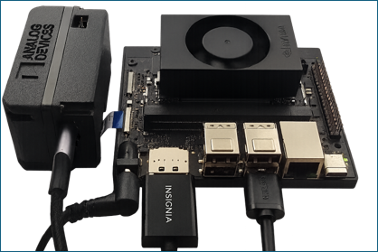
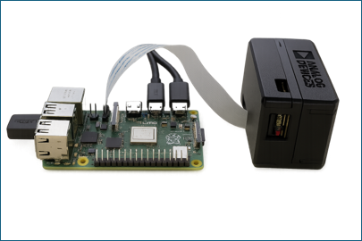

----
 

This page is in preparation for the next release. See the ADCAM tag [v0.1.0-a.1](https://github.com/analogdevicesinc/ADCAM/tree/v0.1.0-a.1) for the latest release.

----


[](https://developer.nvidia.com/embedded/jetson-orin)
[-%2376B900?style=plastic&logo=nvidia&logoColor=white&logoWidth=14)](https://developer.nvidia.com/embedded/jetson-orin)

[](https://www.raspberrypi.com/)
[](https://www.raspberrypi.com/software/)

[](https://isocpp.org)
[](https://www.python.org)

[](LICENSE) 

# ADCAM Camera Kit

## Latest Release

* [ADCAM Release 0.2.0-a.1](https://github.com/analogdevicesinc/ADCAM/releases/tag/v0.2.0-a.1)
  * Please reference the **Quick Start Guide**, on the release page, for setting up the eval kit.
* [ADCAM Eval Kit Documentation](doc/user-guide/ADCAM-CameraKit-020.md)
* The [ADCAM GitHub Wiki](https://github.com/analogdevicesinc/ADCAM/wiki) is a jumping off point for other documentation.

## Overview

This repository contains the source code for the ADI **ADCAM Camera Kit**, which is built around the **ADTF3175D Time-of-Flight (ToF) Mega-Pixel imager** and the **ADSD3500 Depth ISP**.  

The ADCAM hardware interfaces with the **NVIDIA Jetson Orin Nano Developer Kit** or the **Raspberry Pi 5** over **MIPI CSI-2** for image data, and uses **USB-C** solely for power. Unlike the earlier **ADTF3175D Evaluation Kit**, the ADCAM introduces two key improvements:

* **Dual ADSD3500 Depth ISPs**  
  Depth computation is fully handled by hardware, eliminating the need for proprietary SoC-based depth processing libraries. The only exception is the radial-to-XYZ (point cloud generation) step, which is implemented in the open-source [`libaditof`](https://github.com/analogdevicesinc/libaditof/tree/main) library.

This repository depends on the following components:

| Repo | Purpose |
|------|----------|
|[**ToF-drivers**](https://github.com/analogdevicesinc/ToF-drivers/tree/main)|Provides the V4L2 camera sensor driver for the ADSD3500 Depth ISP, along with device tree sources and kernel patches as required.|
|[**libaditof**](https://github.com/analogdevicesinc/libaditof/tree/main)|Provides the SDK supporting the ADCAM system, integrating ADSD3500 Depth ISP processing with the ADI ToF imager.|

## Supported Platforms

|Platform||
|--------|-----|
|[NVIDIA Jetson Orin Nano Developer Kit](https://www.nvidia.com/en-us/autonomous-machines/embedded-systems/jetson-orin/nano-super-developer-kit)||
|[Raspberry Pi 5](https://www.raspberrypi.com/products/raspberry-pi-5/)||

### Requirements

* NVIDIA Jetson Orin Nano Developer Kit: JetPack 6.2.1
* Raspberry Pi 5: Raspberry Pi OS Full (64-bit) Debian Trixie, release 2025-12-04

## Examples

### Core Examples
| Example | Language | Description |
| --------- | ------------- | ----------- |
| tof-viewer | <a href="examples/tof-viewer"> C++ </a> | Graphical User interface for visualising stream from depth camera |
| data-collect | <a href="examples/data_collect"> C++ </a> | A command line application that takes in command line input arguments (like number of frames, mode to be set, folder location to save frame data) and captures the frames and stores in path provided |
| first-frame | <a href="examples/first-frame"> C++ </a> | A C++ that example that shows the steps required to get to the point where camera frames can be captured. |
| first-frame | <br> <a href="examples/bindings/python/first_frame"> Python </a> | A Python that example that shows the steps required to get to the point where camera frames can be captured. |
| streaming example | <br> <a href="examples/bindings/python/streaming"> Python </a> | A Python example that shows streaming depth frames. |

### Other Examples
| Example | Language | Description |
| --------- | ------------- | ----------- |
| ROS2 Application | <a href="https://github.com/analogdevicesinc/adi_3dtof_adtf31xx"> C++ </a> | A more extensive ROS2 example based on the ADI ToF SDK. |
| Stitching Algorithm | <a href="https://github.com/analogdevicesinc/adi_3dtof_image_stitching"> C++ </a> | A stiching algorithm using ADI ToF data. |

## Directory Structure
| Directory | Description |
| --------- | ----------- |
| apps | Applications specific to various targets and hosts. Currently contains the server applications for streaming to the host. |
| ci | Useful scripts for continuous integration |
| cmake | Helper files for cmake |
| dependencies | Contains third-party and owned libraries |
| doc | Documentation |
| examples | Example code for the supported programming languages |
| scripts | Useful development scripts |
| tools | Standalone applications |
| ToF-drivers *(submodule)*| ADSD3500 V4L2 Camera Sensor device driver |
| libaditof *(submodule)*| Submodule with SDK source code |
| sdcard-images-utils | Linux image build tools |

## Building the Eval Kit

Note, prior to committing to the repo it is important to format the source code, see the [code formatting](doc/code-formatting.md) document.

Requirements:
* An internet connect is mandatory.

#### Pre-requisites
* CMake
* g++
* Python 3
* OpenCV - for the examples
* OpenGL - for the examples
* Doxygen - for documentation generation
* Graphviz - for documentation generation

#### Installing the pre-requisites

##### NVIDIA Jeston Orin Nano Dev Kit with JetPack 6.2.1
```console
sudo apt update
sudo apt install cmake g++ \
     libopencv-dev \
     libgl1-mesa-dev libglfw3-dev \
     doxygen graphviz \
     libxinerama-dev \
     libxcursor-dev \
     libxi-dev \
     libxrandr-dev \
     python3.10-dev
```

##### Raspberry Pi OS Full (64-bit) Debian Trixie, release 2025-12-04
```console
sudo apt update
sudo apt install cmake g++ \
     libopencv-dev \
     libgl1-mesa-dev libglfw3-dev \
     doxygen graphviz \
     libxinerama-dev \
     libxcursor-dev \
     libxi-dev \
     libxrandr-dev \
     python3.13-dev
```

In addition the depth compute libraries are required. 

You can get the two libraries from the ADCAM release software, but please note in which case it is under an evaluation license.

For a non-eval license please contact us at *tof@analog.com*.

The two libraries files are:

* libtofi_compute.so
* libtofi_config.so

There are two options for pointing these libraries:

1. Set the **LIBTOFI_LIBDIR_PATH** enviroment variable to the path with these files.
2. Place the libraries must be in a folder called **libs** that in one level below the cloned ADCAM repo folder. For example:
```
(aditofpython_env) analog@analog-desktop:~/dev/ADCAM$ pwd
/home/analog/dev/ADCAM
(aditofpython_env) analog@analog-desktop:~/dev/ADCAM$ tree ../libs
../libs
├── libtofi_compute.so
└── libtofi_config.so
```

### 1. Cloning the Repo

```console
git clone https://github.com/analogdevicesinc/ADCAM.git
cd ADCAM
git submodule update --init
git checkout 0.2.0-a.1
pushd libaditof
git checkout 7.0.0-a.1
popd
pushd ToF-drivers
git checkout 7.0.0-a.1
popd
```

### 2. Kernel Pieces

Updating Linux with the ToF pieces is required before the eval kit is built. To build the kernel you will need a connection to the Internet.

If you are building on an SSD make sure the SSD has airflow since it is beneath the Jetson Orin Nano Dev Kit and may over heat as a result.

The example below using file name **NVIDIA_ToF_ADSD3500_REL_PATCH_08Apr26.zip** and path of **NVIDIA_ToF_ADSD3500_REL_PATCH_08Apr26**. Substitute with the **NVIDIA_ToF_ADSD3500_REL_PATCH_*** created by your build.

Note, this will take sometime to build.

#### NVIDIA Jetson Orin Nano Dev Kit with JetPack 6.2.1

##### Building & Installing

```
cd ADCAM/sdcard-images-utils/nvidia
./setup.sh
./runme.sh 7.0.0-a.1 rel-7.0.0-a.1
unzip NVIDIA_ToF_ADSD3500_REL_PATCH_08Apr26.zip
cd NVIDIA_ToF_ADSD3500_REL_PATCH_08Apr26
sudo ./apply_patch.sh
sudo reboot
```

#### Raspberry Pi OS Full (64-bit) Debian Trixie, release 2025-12-04

##### Building & Installing

Note, this will take sometime to build.
```console
cd ADCAM/sdcard-images-utils/rpi
./setup.sh
./runme.sh 7.0.0-a.1 rel-7.0.0-a.1
cd NVIDIA_ToF_ADSD3500_REL_PATCH_08Apr26
sudo ./apply_patch.sh
sudo reboot
```

### 3. Eval Kit Build

#### Build

##### On Device Build: Jetson Orin Nano Dev Kit or Raspberry Pi 5
Let's start with a standard build. Where we need:
1. Clone the repo.
2. Update the required submodules.
3. Check out the requried branch.
4. Build the code.

```console
cd ADCAM/
mkdir build
cd build
cmake -DCMAKE_BUILD_TYPE=Release ..
cmake --build . -j 6
```

##### CMake options

There are a number of build options available via the root CMakeLists.txt file: https://github.com/analogdevicesinc/ADCAM/blob/6e5b722b5c36923065c4a3be96ad0553d387e699/CMakeLists.txt#L20C1-L24C109
```
option(WITH_EXAMPLES "Build examples?" ON)
option(WITH_DOC "Build documentation?" OFF)
option(WITH_PYTHON "Build python bindings?" ON)
option(WITH_NETWORK "Build network interface?" OFF)
set(WITH_PLATFORM "AUTO" CACHE STRING "Platform selection") # Options are: "AUTO", "NVIDIA", "RPI" or "HOST"
```

* **WITH_EXAMPLES**: Builds all examples that are in the _examples_ folder. Default: ON - ie, build examples.
* **WITH_DOC**: Builds the _doxygen_ documentation. Default: OFF - ie, do not build documentation.
* **WITH_PYTHON**: Builds the Python bindings library, which is required for the Python examples (see: examples/bindings/python). Default: OB - ie, build Python bindings.
* **WITH_NETWORK**: Its complicated, ignore for now. Default: OFF - ie, do not build with network functionality enabled.
* **WITH_PLATFORM**: Sets the target platform for the build. Default: AUTO - ie, attempt to auto detect the platform.
  * **AUTO**: Auto detect between the NVIDIA, Raspberry or Host device
  * **NVIDIA**: Forces a build for NVIDIA Jetson Orin Nano Dev Kit
  * **RPI**: Forces a build for the Raspberry Pi 5
  * **WSL2**: Forces a build for Windows WSL2 (this is **only** for a networked setup)

An example build showing how to change an option during the build process. For this we will disable building the Python bindings. 

Starting in the root of the cloned ADCAM folder:
```console
cd ADCAM
mkdir build
cd build
cmake -DWITH_PYTHON=OFF -DCMAKE_BUILD_TYPE=Release ..
cmake --build . -j 6
```
---
