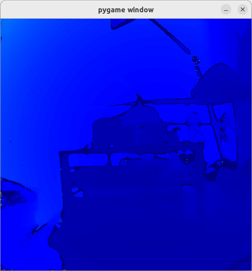
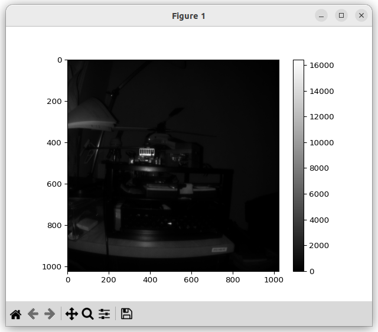
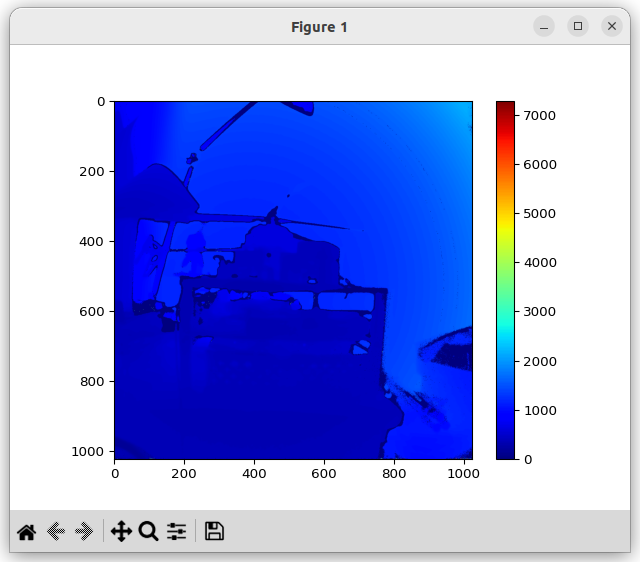
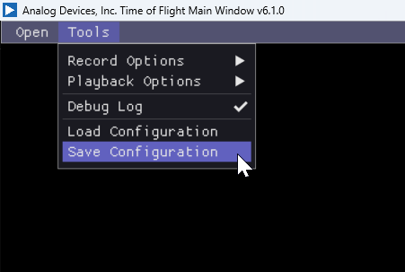

**<span style="font-size:30px;"><u>ADCAM Camera Kit v0.1.0</u></span>

- [🛑 Release Notes 🛑](#-release-notes-)
- [Requirements and Installation](#requirements-and-installation)
- [Using the Eval Kit](#using-the-eval-kit)
  - [Python Tools](#python-tools)
      - [Setup the Virtual Environment](#setup-the-virtual-environment)
      - [Activate the Virtual Environment](#activate-the-virtual-environment)
      - [Deactivate the Virtual Environment](#deactivate-the-virtual-environment)
    - [first\_frame (Python)](#first_frame-python)
      - [Command Line Interface](#command-line-interface)
      - [Example Usage](#example-usage)
    - [data\_collect (Python)](#data_collect-python)
      - [Command Line Interface](#command-line-interface-1)
    - [streaming (Python)](#streaming-python)
      - [Command Line Interface](#command-line-interface-2)
      - [Example Usage](#example-usage-1)
  - [C++ Tools](#c-tools)
    - [first\_frame (C++)](#first_frame-c)
      - [Command Line Interface](#command-line-interface-3)
      - [Example 1: Basic Usage](#example-1-basic-usage)
    - [data\_collect (C++)](#data_collect-c)
      - [Command Line Interface](#command-line-interface-4)
      - [Example 1: Basic Usage](#example-1-basic-usage-1)
      - [Example 2: Saving Configuration Data to JSON](#example-2-saving-configuration-data-to-json)
      - [Example 3: Loading Configuration Data from JSON](#example-3-loading-configuration-data-from-json)
      - [Extracting Data from Saved Streams: rawparser.py](#extracting-data-from-saved-streams-rawparserpy)
        - [Command Line Interface](#command-line-interface-5)
        - [Example Usage](#example-usage-2)
    - [ADIToFGUI (C++)](#aditofgui-c)
        - [Open ADTF3175D Eval Kit](#open-adtf3175d-eval-kit)
        - [Mode Selection](#mode-selection)
        - [Data Views](#data-views)
        - [ADIToFGUI and Configuration Parameters](#aditofgui-and-configuration-parameters)
        - [Troubleshooting](#troubleshooting)
- [Appendix](#appendix)
  - [Configuration JSON File](#configuration-json-file)
    - [General Parameters](#general-parameters)
    - [Mode Parameters](#mode-parameters)

---
---

# 🛑 Release Notes 🛑

  * Which includes the dual configuration ADSD3500 Depth ISP
* Network connection for the Jetson Orin Nano Dev Kit
 
---
---
# Requirements and Installation 

Refer to the Quick Start Guide for installation instructions.

---
---
# Using the Eval Kit

Note, each tool below is supported on Windows 11, Ubuntu 22.04 and Ubuntu 24.04.

## Python Tools

The Python tools rely on the included Python bindings.

#### Setup the Virtual Environment

The Python virtual environment step was done during the setup phase.

If you have not setup the virtual environment,

```
analog@analog-desktop:~$ python --version
Python 3.10.12
analog@analog-desktop:~$ cd ~/ADI/Robotics/Camera/ADCAM/0.1.0/setup
analog@analog-desktop:~/ADI/Robotics/Camera/ADCAM/0.1.0/setup$ ./run_me.sh
Package check and installation complete.
Creating Directory Path Soft Link: /home/analog/ADI/Robotics/Camera/ADCAM/0.1.0/libs
/home/analog/ADI/Robotics/Camera/ADCAM/0.1.0/libs/lib
Using Python 3.10.12 at /usr/bin/python3.10
Reading package lists... Done
Building dependency tree... Done
Reading state information... Done
python3.10-venv is already the newest version (3.10.12-1~22.04.11).
0 upgraded, 0 newly installed, 0 to remove and 0 not upgraded.
Virtual env 'aditofpython_env' created and activated.
Installing requirements (this may take a while)...
Requirement already satisfied: pip in ./aditofpython_env/lib/python3.10/site-packages (22.0.2)
Collecting pip
  Using cached pip-25.3-py3-none-any.whl (1.8 MB)
Installing collected packages: pip
...
analog@analog-desktop:~/ADI/Robotics/Camera/ADCAM/0.1.0/setup$
```

#### Activate the Virtual Environment
```
analog@analog-desktop:~$ cd ~/ADI/Robotics/Camera/ADCAM/0.1.0/eval/Python
analog@analog-desktop:~/ADI/Robotics/Camera/ADCAM/0.1.0/eval/Python$ source activate.sh
Activating ADI ToF python env
(aditofpython_env) analog@analog-desktop:~/ADI/Robotics/Camera/ADCAM/0.1.0/eval/Python$
```

#### Deactivate the Virtual Environment

* deactivate

### first_frame (Python)

A basic example showing how to get a frame from the device.

#### Command Line Interface

```
(aditofpython_env) analog@analog-desktop:~/ADI/Robotics/Camera/ADCAM/0.1.0/eval/Python$ python first_frame.py
first_frame.py usage:
Target: first_frame.py <mode number> <show frames(0/1)>
Network connection: first_frame.py <mode number> <ip> <show frames (0/1)>

For example:
python first_frame.py 0 192.168.56.1 0
```

#### Example Usage

```
(aditofpython_env) analog@analog-desktop:~/ADI/Robotics/Camera/ADCAM/0.1.0/eval/Python$ python first_frame.py 3 1
SDK version:  6.2.0  | branch:  test-fix  | commit:  5b4788d2
Looking for camera on Target.
I20251031 16:14:18.688588 15387 sensor_enumerator_nvidia.cpp:109] Looking for sensors on the target
I20251031 16:14:18.692440 15387 buffer_processor.cpp:87] BufferProcessor initialized
I20251031 16:14:18.692580 15387 camera_itof.cpp:105] Sensor name = adsd3500
system.getCameraList() Status.Ok
I20251031 16:14:18.692739 15387 camera_itof.cpp:125] Initializing camera
I20251031 16:14:18.692774 15387 adsd3500_sensor.cpp:241] Opening device
I20251031 16:14:18.692795 15387 adsd3500_sensor.cpp:259] Looking for the following cards:
I20251031 16:14:18.692812 15387 adsd3500_sensor.cpp:261] vi-output, adsd3500
I20251031 16:14:18.692830 15387 adsd3500_sensor.cpp:273] device: /dev/video0	subdevice: /dev/v4l-subdev1
I20251031 16:14:18.693836 15387 adsd3500_interrupt_notifier.cpp:34] ADSD3500 Interrupt handler registered.
I20251031 16:14:18.795434 15387 adsd3500_sensor.cpp:1473] Waiting for ADSD3500 to reset.
I20251031 16:14:18.795521 15387 adsd3500_sensor.cpp:1478] .
I20251031 16:14:19.795652 15387 adsd3500_sensor.cpp:1478] .
I20251031 16:14:20.795924 15387 adsd3500_sensor.cpp:1478] .
I20251031 16:14:21.796171 15387 adsd3500_sensor.cpp:1478] .
I20251031 16:14:22.796642 15387 adsd3500_sensor.cpp:1478] .
I20251031 16:14:23.796901 15387 adsd3500_sensor.cpp:1478] .
I20251031 16:14:24.797380 15387 adsd3500_sensor.cpp:1478] .
I20251031 16:14:25.193864 15387 adsd3500_interrupt_notifier.cpp:38] signalEventHandler
Running the python callback for which the status of ADSD3500 has been forwarded. ADSD3500 status =  Adsd3500Status.OK
I20251031 16:14:26.195517 15387 adsd3500_interrupt_notifier.cpp:38] signalEventHandler
Running the python callback for which the status of ADSD3500 has been forwarded. ADSD3500 status =  Adsd3500Status.OK
I20251031 16:14:27.800415 15387 adsd3500_sensor.cpp:1483] Waited: 7 seconds
I20251031 16:14:27.912683 15387 adsd3500_sensor.cpp:395] ADSD3500 is ready to communicate with.
I20251031 16:14:27.914397 15387 adsd3500_sensor.cpp:1947] CCB master not supported. Using sdk defined modes.
I20251031 16:14:27.932107 15387 camera_itof.cpp:222] Current adsd3500 firmware version is: 7.0.0.0
I20251031 16:14:27.932222 15387 camera_itof.cpp:224] Current adsd3500 firmware git hash is: 140fe63206d9435f2f3c7a050606477e05b70e00
W20251031 16:14:27.932568 15387 camera_itof.cpp:252] fsyncMode is not being set by SDK.
W20251031 16:14:27.932804 15387 camera_itof.cpp:267] mipiSpeed is not being set by SDK.Setting default 2.5Gbps
W20251031 16:14:27.933041 15387 camera_itof.cpp:283] deskew is not being set by SDK, Setting it by default.
W20251031 16:14:27.933070 15387 camera_itof.cpp:295] enableTempCompenstation is not being set by SDK.
W20251031 16:14:27.933085 15387 camera_itof.cpp:305] enableEdgeConfidence is not being set by SDK.
I20251031 16:14:27.939248 15387 camera_itof.cpp:311] Module serial number: 026ao173007q0q4f14 
I20251031 16:14:27.939273 15387 camera_itof.cpp:319] Camera initialized
camera1.initialize() Status.Ok
camera1.getAvailableModes() Status.Ok
[0, 1, 2, 3, 6, 5]
camera1.getDetails() Status.Ok
camera1 details: id: /dev/video0 connection: ConnectionType.OnTarget
I20251031 16:14:27.939720 15387 adsd3500_sensor.cpp:241] Opening device
I20251031 16:14:27.939757 15387 adsd3500_sensor.cpp:259] Looking for the following cards:
I20251031 16:14:27.939774 15387 adsd3500_sensor.cpp:261] vi-output, adsd3500
I20251031 16:14:27.939790 15387 adsd3500_sensor.cpp:273] device: /dev/video0	subdevice: /dev/v4l-subdev1
I20251031 16:14:27.945324 15387 buffer_processor.cpp:192] setVideoProperties: Allocating 3 raw frame buffers, each of size 1313280 bytes (total: 3.75732 MB)
I20251031 16:14:27.945533 15387 buffer_processor.cpp:220] setVideoProperties: Allocating 3 ToFi buffers, each of size 4194304 bytes (total: 12 MB)
I20251031 16:14:28.147232 15387 camera_itof.cpp:1845] Camera FPS set from parameter list at: 25
W20251031 16:14:28.147326 15387 camera_itof.cpp:2065] vcselDelay was not found in parameter list, not setting.
W20251031 16:14:28.147878 15387 camera_itof.cpp:2117] enablePhaseInvalidation was not found in parameter list, not setting.
I20251031 16:14:28.147944 15387 camera_itof.cpp:401] Using the following configuration parameters for mode 3
I20251031 16:14:28.147963 15387 camera_itof.cpp:404] abThreshMin : 3.0
I20251031 16:14:28.147977 15387 camera_itof.cpp:404] bitsInAB : 16
I20251031 16:14:28.147989 15387 camera_itof.cpp:404] bitsInConf : 8
I20251031 16:14:28.148002 15387 camera_itof.cpp:404] bitsInPhaseOrDepth : 16
I20251031 16:14:28.148013 15387 camera_itof.cpp:404] confThresh : 25.0
I20251031 16:14:28.148024 15387 camera_itof.cpp:404] depthComputeIspEnable : 1
I20251031 16:14:28.148035 15387 camera_itof.cpp:404] fps : 25
I20251031 16:14:28.148046 15387 camera_itof.cpp:404] headerSize : 128
I20251031 16:14:28.148057 15387 camera_itof.cpp:404] inputFormat : raw8
I20251031 16:14:28.148068 15387 camera_itof.cpp:404] interleavingEnable : 1
I20251031 16:14:28.148079 15387 camera_itof.cpp:404] jblfABThreshold : 10.0
I20251031 16:14:28.148090 15387 camera_itof.cpp:404] jblfApplyFlag : 1
I20251031 16:14:28.148102 15387 camera_itof.cpp:404] jblfExponentialTerm : 5.0
I20251031 16:14:28.148117 15387 camera_itof.cpp:404] jblfGaussianSigma : 10.0
I20251031 16:14:28.148130 15387 camera_itof.cpp:404] jblfMaxEdge : 12.0
I20251031 16:14:28.148144 15387 camera_itof.cpp:404] jblfWindowSize : 7
I20251031 16:14:28.148159 15387 camera_itof.cpp:404] partialDepthEnable : 0
I20251031 16:14:28.148172 15387 camera_itof.cpp:404] phaseInvalid : 0
I20251031 16:14:28.148186 15387 camera_itof.cpp:404] radialThreshMax : 10000.0
I20251031 16:14:28.148200 15387 camera_itof.cpp:404] radialThreshMin : 100.0
I20251031 16:14:28.148213 15387 camera_itof.cpp:404] xyzEnable : 1
I20251031 16:14:28.148363 15387 camera_itof.cpp:414] Metadata in AB is enabled and it is stored in the first 128 bytes.
I20251031 16:14:28.382210 15387 camera_itof.cpp:505] Using closed source depth compute library.
camera1.setMode( 3 ) Status.Ok
I20251031 16:14:28.520082 15387 adsd3500_sensor.cpp:452] Starting device 0
I20251031 16:14:28.541168 15387 buffer_processor.cpp:733] startThreads: Starting Threads..
camera1.start() Status.Ok
I20251031 16:14:28.569851 15387 camera_itof.cpp:637] Dropped first frame
camera1.requestFrame() Status.Ok
frame.getDataDetails() Status.Ok
depth frame details: width: 512 height: 512 type: depth
I20251031 16:14:29.403737 15387 buffer_processor.cpp:786] stopThreads: Threads Stopped. Raw buffers freed: 3, ToFi buffers freed: 3
I20251031 16:14:29.404676 15387 adsd3500_sensor.cpp:497] Stopping device
I20251031 16:14:29.409727 15387 adsd3500_sensor.cpp:1517] Waiting for interrupt.
I20251031 16:14:29.409778 15387 adsd3500_sensor.cpp:1522] .
I20251031 16:14:29.429883 15387 adsd3500_sensor.cpp:1522] .
I20251031 16:14:29.433671 15387 adsd3500_interrupt_notifier.cpp:38] signalEventHandler
Running the python callback for which the status of ADSD3500 has been forwarded. ADSD3500 status =  Adsd3500Status.Imager_Stream_Off
Running the python callback for which the status of ADSD3500 has been forwarded. ADSD3500 status =  Adsd3500Status.Imager_Stream_Off
I20251031 16:14:31.451870 15387 adsd3500_sensor.cpp:1527] Waited: 40 ms.
I20251031 16:14:31.451979 15387 adsd3500_sensor.cpp:1534] Got the Interrupt from ADSD3500
camera1.stop() Status.Ok
Sensor temperature from metadata:  35
Laser temperature from metadata:  36
Frame number from metadata:  1
Mode from metadata:  3
I20251031 16:15:02.018120 15387 buffer_processor.cpp:97] freeComputeLibrary
```

[](images/first-frame-py.png)

### data_collect (Python)

A data collect example, but in Python. This will not be covered in detail since it is similar to data_collect binary executable.

#### Command Line Interface

```
(aditofpython_env) analog@analog-desktop:~/ADI/Robotics/Camera/ADCAM/0.1.0/eval/Python$ python data_collect.py -h
usage: data_collect.py [-h] [-f <folder>] [-n <ncapture>] [-m <mode>] [-wt <warmup>] [-ccb <FILE>] [-ip <ip>] [-fw <firmware>] [-s] [-t]
                       [-st] [-ic <imager-configuration>] [-scf <save-configuration-file>] [-lcf <load-configuration-file>]

Script to run data collect python script

options:
  -h, --help            show this help message and exit
  -f <folder>           output folder [default: ./]
  -n <ncapture>         number of frame captured[default: 1]
  -m <mode>             Valid mode (-m) options are: 0: short-range native; 1: long-range native; 2: short-range Qnative; 3: long-range
                        Qnative 4: pcm-native; 5: long-range mixed; 6: short-range mixed; Note: --m argument supports index (Default: 0)
  -wt <warmup>          warmup time in seconds[default: 0]
  -ccb <FILE>           The path to store CCB content
  -ip <ip>              camera IP[default: 192.168.56.1]
  -fw <firmware>        Adsd3500 firmware file
  -s, --split           Save each frame into a separate file (Debug)
  -t, --netlinktest     Puts server on target in test mode (Debug)
  -st, --singlethread   Store the frame to file using same thread
  -ic <imager-configuration>
                        Select imager configuration. By default is standard.
  -scf <save-configuration-file>
                        Save current configuration to json file
  -lcf <load-configuration-file>
                        Load custom configuration to json file
```

### streaming (Python)

This tool uses Pygame to show streaming frames from the device in real-time.

#### Command Line Interface

```
(aditofpython_env) analog@analog-desktop:~/ADI/Robotics/Camera/ADCAM/0.1.0/eval/Python$ python depth-image-animation-pygame.py
pygame 2.6.1 (SDL 2.28.4, Python 3.10.12)
Hello from the pygame community. https://www.pygame.org/contribute.html
depth-image-animation-pygame.py usage:
Target: depth-image-animation-pygame.py <mode number>
Network connection: depth-image-animation-pygame.py <mode number> <ip>

For example:
python depth-image-animation-pygame.py 0 192.168.56.1
```

#### Example Usage

```
(aditofpython_env) analog@analog-desktop:~/ADI/Robotics/Camera/ADCAM/0.1.0/eval/Python$ python depth-image-animation-pygame.py 3
pygame 2.6.1 (SDL 2.28.4, Python 3.10.12)
Hello from the pygame community. https://www.pygame.org/contribute.html
SDK version:  6.2.0  | branch:  test-fix  | commit:  5b4788d2
Looking for camera on Target.
I20251031 16:07:56.890069 14944 sensor_enumerator_nvidia.cpp:109] Looking for sensors on the target
I20251031 16:07:56.893855 14944 buffer_processor.cpp:87] BufferProcessor initialized
I20251031 16:07:56.894007 14944 camera_itof.cpp:105] Sensor name = adsd3500
system.getCameraList() Status.Ok
I20251031 16:07:56.894137 14944 camera_itof.cpp:125] Initializing camera
I20251031 16:07:56.894166 14944 adsd3500_sensor.cpp:241] Opening device
I20251031 16:07:56.894185 14944 adsd3500_sensor.cpp:259] Looking for the following cards:
I20251031 16:07:56.894200 14944 adsd3500_sensor.cpp:261] vi-output, adsd3500
I20251031 16:07:56.894220 14944 adsd3500_sensor.cpp:273] device: /dev/video0	subdevice: /dev/v4l-subdev1
I20251031 16:07:56.895256 14944 adsd3500_interrupt_notifier.cpp:34] ADSD3500 Interrupt handler registered.
I20251031 16:07:56.996677 14944 adsd3500_sensor.cpp:1473] Waiting for ADSD3500 to reset.
I20251031 16:07:56.996742 14944 adsd3500_sensor.cpp:1478] .
I20251031 16:07:57.996867 14944 adsd3500_sensor.cpp:1478] .
I20251031 16:07:58.997101 14944 adsd3500_sensor.cpp:1478] .
I20251031 16:07:59.997349 14944 adsd3500_sensor.cpp:1478] .
I20251031 16:08:00.997849 14944 adsd3500_sensor.cpp:1478] .
I20251031 16:08:01.998104 14944 adsd3500_sensor.cpp:1478] .
I20251031 16:08:02.998369 14944 adsd3500_sensor.cpp:1478] .
I20251031 16:08:03.395159 14944 adsd3500_interrupt_notifier.cpp:38] signalEventHandler
I20251031 16:08:04.396248 14944 adsd3500_interrupt_notifier.cpp:38] signalEventHandler
I20251031 16:08:06.000733 14944 adsd3500_sensor.cpp:1483] Waited: 7 seconds
I20251031 16:08:06.112979 14944 adsd3500_sensor.cpp:395] ADSD3500 is ready to communicate with.
I20251031 16:08:06.114677 14944 adsd3500_sensor.cpp:1947] CCB master not supported. Using sdk defined modes.
I20251031 16:08:06.132175 14944 camera_itof.cpp:222] Current adsd3500 firmware version is: 7.0.0.0
I20251031 16:08:06.132270 14944 camera_itof.cpp:224] Current adsd3500 firmware git hash is: 140fe63206d9435f2f3c7a050606477e05b70e00
W20251031 16:08:06.132605 14944 camera_itof.cpp:252] fsyncMode is not being set by SDK.
W20251031 16:08:06.132843 14944 camera_itof.cpp:267] mipiSpeed is not being set by SDK.Setting default 2.5Gbps
W20251031 16:08:06.133114 14944 camera_itof.cpp:283] deskew is not being set by SDK, Setting it by default.
W20251031 16:08:06.133153 14944 camera_itof.cpp:295] enableTempCompenstation is not being set by SDK.
W20251031 16:08:06.133178 14944 camera_itof.cpp:305] enableEdgeConfidence is not being set by SDK.
I20251031 16:08:06.139346 14944 camera_itof.cpp:311] Module serial number: 026ao173007q0q4f14 
I20251031 16:08:06.139373 14944 camera_itof.cpp:319] Camera initialized
camera1.initialize() Status.Ok
camera1.getAvailableModes() Status.Ok
[0, 1, 2, 3, 6, 5]
camera1.getDetails() Status.Ok
camera1 details: id: /dev/video0 connection: ConnectionType.OnTarget
I20251031 16:08:06.139835 14944 adsd3500_sensor.cpp:241] Opening device
I20251031 16:08:06.139869 14944 adsd3500_sensor.cpp:259] Looking for the following cards:
I20251031 16:08:06.139886 14944 adsd3500_sensor.cpp:261] vi-output, adsd3500
I20251031 16:08:06.139905 14944 adsd3500_sensor.cpp:273] device: /dev/video0	subdevice: /dev/v4l-subdev1
I20251031 16:08:06.145685 14944 buffer_processor.cpp:192] setVideoProperties: Allocating 3 raw frame buffers, each of size 1313280 bytes (total: 3.75732 MB)
I20251031 16:08:06.145850 14944 buffer_processor.cpp:220] setVideoProperties: Allocating 3 ToFi buffers, each of size 4194304 bytes (total: 12 MB)
I20251031 16:08:06.348497 14944 camera_itof.cpp:1845] Camera FPS set from parameter list at: 25
W20251031 16:08:06.348579 14944 camera_itof.cpp:2065] vcselDelay was not found in parameter list, not setting.
W20251031 16:08:06.349279 14944 camera_itof.cpp:2117] enablePhaseInvalidation was not found in parameter list, not setting.
I20251031 16:08:06.349378 14944 camera_itof.cpp:401] Using the following configuration parameters for mode 3
I20251031 16:08:06.349412 14944 camera_itof.cpp:404] abThreshMin : 3.0
I20251031 16:08:06.349438 14944 camera_itof.cpp:404] bitsInAB : 16
I20251031 16:08:06.349462 14944 camera_itof.cpp:404] bitsInConf : 8
I20251031 16:08:06.349486 14944 camera_itof.cpp:404] bitsInPhaseOrDepth : 16
I20251031 16:08:06.349511 14944 camera_itof.cpp:404] confThresh : 25.0
I20251031 16:08:06.349534 14944 camera_itof.cpp:404] depthComputeIspEnable : 1
I20251031 16:08:06.349558 14944 camera_itof.cpp:404] fps : 25
I20251031 16:08:06.349581 14944 camera_itof.cpp:404] headerSize : 128
I20251031 16:08:06.349606 14944 camera_itof.cpp:404] inputFormat : raw8
I20251031 16:08:06.349630 14944 camera_itof.cpp:404] interleavingEnable : 1
I20251031 16:08:06.349653 14944 camera_itof.cpp:404] jblfABThreshold : 10.0
I20251031 16:08:06.349675 14944 camera_itof.cpp:404] jblfApplyFlag : 1
I20251031 16:08:06.349699 14944 camera_itof.cpp:404] jblfExponentialTerm : 5.0
I20251031 16:08:06.349722 14944 camera_itof.cpp:404] jblfGaussianSigma : 10.0
I20251031 16:08:06.349744 14944 camera_itof.cpp:404] jblfMaxEdge : 12.0
I20251031 16:08:06.349765 14944 camera_itof.cpp:404] jblfWindowSize : 7
I20251031 16:08:06.349788 14944 camera_itof.cpp:404] partialDepthEnable : 0
I20251031 16:08:06.349811 14944 camera_itof.cpp:404] phaseInvalid : 0
I20251031 16:08:06.349832 14944 camera_itof.cpp:404] radialThreshMax : 10000.0
I20251031 16:08:06.349854 14944 camera_itof.cpp:404] radialThreshMin : 100.0
I20251031 16:08:06.349875 14944 camera_itof.cpp:404] xyzEnable : 1
I20251031 16:08:06.350088 14944 camera_itof.cpp:414] Metadata in AB is enabled and it is stored in the first 128 bytes.
I20251031 16:08:06.586561 14944 camera_itof.cpp:505] Using closed source depth compute library.
camera1.setMode() Status.Ok
I20251031 16:08:06.724150 14944 adsd3500_sensor.cpp:452] Starting device 0
I20251031 16:08:06.748148 14944 buffer_processor.cpp:733] startThreads: Starting Threads..
camera1.start() Status.Ok
W20251031 16:08:07.044452 14944 buffer_processor.cpp:326] captureFrameThread: No free buffers m_v4l2_input_buffer_Q size: 0
W20251031 16:08:07.046972 14944 buffer_processor.cpp:436] processThread: No new frames, m_captureToProcessQueue Size: 0
I20251031 16:08:07.193199 14944 camera_itof.cpp:637] Dropped first frame
I20251031 16:09:09.686602 14944 buffer_processor.cpp:786] stopThreads: Threads Stopped. Raw buffers freed: 3, ToFi buffers freed: 3
I20251031 16:09:09.687419 14944 adsd3500_sensor.cpp:497] Stopping device
I20251031 16:09:09.691710 14944 adsd3500_sensor.cpp:1517] Waiting for interrupt.
I20251031 16:09:09.691789 14944 adsd3500_sensor.cpp:1522] .
I20251031 16:09:09.711925 14944 adsd3500_sensor.cpp:1522] .
I20251031 16:09:09.716511 14944 adsd3500_interrupt_notifier.cpp:38] signalEventHandler
I20251031 16:09:11.733403 14944 adsd3500_sensor.cpp:1527] Waited: 40 ms.
I20251031 16:09:11.733551 14944 adsd3500_sensor.cpp:1534] Got the Interrupt from ADSD3500
I20251031 16:09:11.840667 14944 buffer_processor.cpp:97] freeComputeLibrary
```

[](images/depth-image-animation-pygame.png)

## C++ Tools

### first_frame (C++)

#### Command Line Interface
```
analog@analog-desktop:~/ADI/Robotics/Camera/ADCAM/0.1.0/eval/C++/first-frame$ ./first-frame -h
First-frame usage:
    first-frame
    first-frame (-h | --help)
    first-frame [-ip | --ip <ip>] [-m | --m <mode>] [-config | --config <config_file.json>]

    Arguments:
      config_file.json   Input config_default.json file (which has *.ccb and *.cfg)

    Options:
      -h --help          Show this screen.
      -m --m <mode>      Mode to capture data in. [default: 0]

    NOTE: -m | --m argument supports both index and string (0/sr-native)

    Valid mode (-m | --m) options are:
        0: short-range native
        1: long-range native
        2: short-range Qnative
        3: long-range Qnative
        4: pcm-native
        5: long-range mixed
        6: short-range mixed
```

#### Example 1: Basic Usage
* *--m 1*: Use mode 1.
```
analog@analog-desktop:~/ADI/Robotics/Camera/ADCAM/0.1.0/eval/C++/first-frame$ ./first-frame --m 1
I20251031 15:45:19.389389 14132 main.cpp:151] ADCAM version: 0.1.0 | SDK version: 6.2.0 | branch: test-fix | commit: 5b4788d2
I20251031 15:45:19.389587 14132 sensor_enumerator_nvidia.cpp:109] Looking for sensors on the target
I20251031 15:45:19.393838 14132 buffer_processor.cpp:87] BufferProcessor initialized
I20251031 15:45:19.393966 14132 camera_itof.cpp:105] Sensor name = adsd3500
I20251031 15:45:19.394005 14132 camera_itof.cpp:125] Initializing camera
I20251031 15:45:19.394030 14132 adsd3500_sensor.cpp:241] Opening device
I20251031 15:45:19.394053 14132 adsd3500_sensor.cpp:259] Looking for the following cards:
I20251031 15:45:19.394069 14132 adsd3500_sensor.cpp:261] vi-output, adsd3500
I20251031 15:45:19.394093 14132 adsd3500_sensor.cpp:273] device: /dev/video0    subdevice: /dev/v4l-subdev1
I20251031 15:45:19.395509 14132 adsd3500_interrupt_notifier.cpp:34] ADSD3500 Interrupt handler registered.
I20251031 15:45:19.497090 14132 adsd3500_sensor.cpp:1473] Waiting for ADSD3500 to reset.
I20251031 15:45:19.497151 14132 adsd3500_sensor.cpp:1478] .
I20251031 15:45:20.497260 14132 adsd3500_sensor.cpp:1478] .
I20251031 15:45:21.497447 14132 adsd3500_sensor.cpp:1478] .
I20251031 15:45:22.497634 14132 adsd3500_sensor.cpp:1478] .
I20251031 15:45:23.497811 14132 adsd3500_sensor.cpp:1478] .
I20251031 15:45:24.497995 14132 adsd3500_sensor.cpp:1478] .
I20251031 15:45:25.498182 14132 adsd3500_sensor.cpp:1478] .
I20251031 15:45:25.895282 14132 adsd3500_interrupt_notifier.cpp:38] signalEventHandler
I20251031 15:45:26.895975 14132 main.cpp:191] Running the callback for which the status of ADSD3500 has been forwarded. ADSD3500 status = Adsd3500Status::OK
I20251031 15:45:26.896049 14132 adsd3500_interrupt_notifier.cpp:38] signalEventHandler
I20251031 15:45:27.896638 14132 main.cpp:191] Running the callback for which the status of ADSD3500 has been forwarded. ADSD3500 status = Adsd3500Status::OK
I20251031 15:45:28.499872 14132 adsd3500_sensor.cpp:1483] Waited: 7 seconds
I20251031 15:45:28.611884 14132 adsd3500_sensor.cpp:395] ADSD3500 is ready to communicate with.
I20251031 15:45:28.613903 14132 adsd3500_sensor.cpp:1947] CCB master not supported. Using sdk defined modes.
I20251031 15:45:28.631372 14132 camera_itof.cpp:222] Current adsd3500 firmware version is: 7.0.0.0
I20251031 15:45:28.631445 14132 camera_itof.cpp:224] Current adsd3500 firmware git hash is: 140fe63206d9435f2f3c7a050606477e05b70e00
W20251031 15:45:28.631759 14132 camera_itof.cpp:252] fsyncMode is not being set by SDK.
W20251031 15:45:28.631995 14132 camera_itof.cpp:267] mipiSpeed is not being set by SDK.Setting default 2.5Gbps
W20251031 15:45:28.632222 14132 camera_itof.cpp:283] deskew is not being set by SDK, Setting it by default.
W20251031 15:45:28.632261 14132 camera_itof.cpp:295] enableTempCompenstation is not being set by SDK.
W20251031 15:45:28.632286 14132 camera_itof.cpp:305] enableEdgeConfidence is not being set by SDK.
I20251031 15:45:28.638536 14132 camera_itof.cpp:311] Module serial number: 026ao173007q0q4f14
I20251031 15:45:28.638560 14132 camera_itof.cpp:319] Camera initialized
I20251031 15:45:28.638706 14132 adsd3500_sensor.cpp:241] Opening device
I20251031 15:45:28.638731 14132 adsd3500_sensor.cpp:259] Looking for the following cards:
I20251031 15:45:28.638746 14132 adsd3500_sensor.cpp:261] vi-output, adsd3500
I20251031 15:45:28.638758 14132 adsd3500_sensor.cpp:273] device: /dev/video0    subdevice: /dev/v4l-subdev1
I20251031 15:45:28.651077 14132 buffer_processor.cpp:192] setVideoProperties: Allocating 3 raw frame buffers, each of size 4195328 bytes (total: 12.0029 MB)
I20251031 15:45:28.651307 14132 buffer_processor.cpp:220] setVideoProperties: Allocating 3 ToFi buffers, each of size 16777216 bytes (total: 48 MB)
I20251031 15:45:28.853061 14132 camera_itof.cpp:1845] Camera FPS set from parameter list at: 10
W20251031 15:45:28.853120 14132 camera_itof.cpp:2065] vcselDelay was not found in parameter list, not setting.
W20251031 15:45:28.853670 14132 camera_itof.cpp:2117] enablePhaseInvalidation was not found in parameter list, not setting.
I20251031 15:45:28.853725 14132 camera_itof.cpp:401] Using the following configuration parameters for mode 1
I20251031 15:45:28.853742 14132 camera_itof.cpp:404] abThreshMin : 3.0
I20251031 15:45:28.853754 14132 camera_itof.cpp:404] bitsInAB : 16
I20251031 15:45:28.853765 14132 camera_itof.cpp:404] bitsInConf : 0
I20251031 15:45:28.853775 14132 camera_itof.cpp:404] bitsInPhaseOrDepth : 16
I20251031 15:45:28.853786 14132 camera_itof.cpp:404] confThresh : 25.0
I20251031 15:45:28.853796 14132 camera_itof.cpp:404] depthComputeIspEnable : 1
I20251031 15:45:28.853806 14132 camera_itof.cpp:404] fps : 10
I20251031 15:45:28.853817 14132 camera_itof.cpp:404] headerSize : 128
I20251031 15:45:28.853827 14132 camera_itof.cpp:404] inputFormat : mipiRaw12_8
I20251031 15:45:28.853838 14132 camera_itof.cpp:404] interleavingEnable : 0
I20251031 15:45:28.853848 14132 camera_itof.cpp:404] jblfABThreshold : 10.0
I20251031 15:45:28.853859 14132 camera_itof.cpp:404] jblfApplyFlag : 1
I20251031 15:45:28.853870 14132 camera_itof.cpp:404] jblfExponentialTerm : 5.0
I20251031 15:45:28.853880 14132 camera_itof.cpp:404] jblfGaussianSigma : 10.0
I20251031 15:45:28.853891 14132 camera_itof.cpp:404] jblfMaxEdge : 12.0
I20251031 15:45:28.853904 14132 camera_itof.cpp:404] jblfWindowSize : 7
I20251031 15:45:28.853920 14132 camera_itof.cpp:404] partialDepthEnable : 1
I20251031 15:45:28.853932 14132 camera_itof.cpp:404] phaseInvalid : 0
I20251031 15:45:28.853943 14132 camera_itof.cpp:404] radialThreshMax : 10000.0
I20251031 15:45:28.853955 14132 camera_itof.cpp:404] radialThreshMin : 100.0
I20251031 15:45:28.853967 14132 camera_itof.cpp:404] xyzEnable : 1
I20251031 15:45:28.854124 14132 camera_itof.cpp:414] Metadata in AB is enabled and it is stored in the first 128 bytes.
I20251031 15:45:29.734029 14132 camera_itof.cpp:505] Using closed source depth compute library.
I20251031 15:45:30.279183 14132 adsd3500_sensor.cpp:452] Starting device 0
I20251031 15:45:30.299925 14132 buffer_processor.cpp:733] startThreads: Starting Threads..
I20251031 15:45:30.354221 14132 camera_itof.cpp:637] Dropped first frame
I20251031 15:45:30.448852 14132 main.cpp:248] succesfully requested frame!
I20251031 15:45:31.256508 14132 buffer_processor.cpp:786] stopThreads: Threads Stopped. Raw buffers freed: 3, ToFi buffers freed: 3
I20251031 15:45:31.257488 14132 adsd3500_sensor.cpp:497] Stopping device
I20251031 15:45:31.262425 14132 adsd3500_sensor.cpp:1517] Waiting for interrupt.
I20251031 15:45:31.262499 14132 adsd3500_sensor.cpp:1522] .
I20251031 15:45:31.282624 14132 adsd3500_sensor.cpp:1522] .
I20251031 15:45:31.286629 14132 adsd3500_interrupt_notifier.cpp:38] signalEventHandler
I20251031 15:45:32.287926 14132 main.cpp:191] Running the callback for which the status of ADSD3500 has been forwarded. ADSD3500 status = Adsd3500Status::IMAGER_STREAM_OFF
I20251031 15:45:33.288791 14132 main.cpp:191] Running the callback for which the status of ADSD3500 has been forwarded. ADSD3500 status = Adsd3500Status::IMAGER_STREAM_OFF
I20251031 15:45:33.305080 14132 adsd3500_sensor.cpp:1527] Waited: 40 ms.
I20251031 15:45:33.305136 14132 adsd3500_sensor.cpp:1534] Got the Interrupt from ADSD3500
I20251031 15:45:33.305173 14132 camera_itof.cpp:1943] No chip/imager errors detected.
I20251031 15:45:33.305201 14132 main.cpp:268] Chip status error code: 41
I20251031 15:45:33.305226 14132 main.cpp:269] Imager status error code: 0
I20251031 15:45:33.305253 14132 main.cpp:278] Sensor Temperature: 36
I20251031 15:45:33.305277 14132 main.cpp:279] Laser Temperature: 36
I20251031 15:45:33.305300 14132 main.cpp:280] Frame Number: 1
I20251031 15:45:33.305325 14132 main.cpp:281] Mode: 1
I20251031 15:45:33.309987 14132 buffer_processor.cpp:97] freeComputeLibrary
```

Two files should have been generated:
* out_ab_mode_1.bin  
* out_depth_mode_1.bin

Note, for visualzation, it is assumed that the Python environment is still active.

To visualize the AB output:
```
(aditofpython_env) analog@analog-desktop:~/ADI/Robotics/Camera/ADCAM/0.1.0/eval/C++/first-frame$ python ../../../tools/visualization/visualize_ab.py out_ab_mode_1.bin 1024 1024
Input file is:  out_ab_mode_1.bin

```

[](images/first-frame-c++-visualize-ab.png)

To visualize the depth output:
```
aditofpython_env) analog@analog-desktop:~/ADI/Robotics/Camera/ADCAM/0.1.0/eval/C++/first-frame$ python ../../../tools/visualization/visualize_depth.py out_depth_mode_1.bin 1024 1024
Input file is:  out_depth_mode_1.bin
```

[](images/first-frame-c++-visualize-depth.png)

### data_collect (C++)

**data_collect** is use save a stream of frames to the file system of the host computer. 

#### Command Line Interface
```
$ data_collect -h
Usage: data_collect [options]
    Data Collect.
    Usage:
      data_collect 
      data_collect [--f <folder>] [--n <ncapture>] [--m <mode>] [--wt <warmup>] [--ccb FILE] [--ip <ip>] [--fw <firmware>] [-s | --split] [-t | --netlinktest] [--ic <imager-configuration>] [-scf <save-configuration-file>] [-lcf <load-configuration-file>]
      data_collect (-h | --help)

    Options:
      -h --help          Show this screen.
      --f <folder>       Output folder (max name 512) [default: ./]
      --n <ncapture>     Capture frame num. [default: 1]
      --m <mode>         Mode to capture data in. [default: 0]
      --wt <warmup>      Warmup Time (sec) [default: 0]
      --ccb <FILE>       The path to store CCB content
      --ip <ip>          Camera IP
      --fw <firmware>    Adsd3500 fw file
      --split            Save each frame into a separate file (Debug)
      --netlinktest      Puts server on target in test mode (Debug)
      --singlethread     Store the frame to file using same thread
      --ic <imager-configuration>   Select imager configuration: standard, standard-raw,
                         custom, custom-raw. By default is standard.
      --scf <save-configuration-file>    Save current configuration to json file
      --lcf <load-configuration-file>    Load configuration from json file

    Note: --m argument supports index (0, 1, etc.) 

    Valid mode (--m) options are:
        0: short-range native
        1: long-range native
        2: short-range Qnative
        3: long-range Qnative
        4: pcm-native
        5: long-range mixed
        6: short-range mixed
```

#### Example 1: Basic Usage
* *--f output*: Place captured data into the folder *output*.
* *--m 1*: Use mode 1.
* *--n 100*: Capture 100 frames.
```
$ data_collect --f output --m 1 --n 100
I20250709 15:20:25.556339 28592 main.cpp:169] SDK version: 6.1.0 | branch:  | commit:
I20250709 15:20:25.571966 28592 main.cpp:285] Output folder: output
I20250709 15:20:25.571966 28592 main.cpp:286] Mode: 1
I20250709 15:20:25.571966 28592 main.cpp:287] Number of frames: 100
I20250709 15:20:25.571966 28592 main.cpp:288] Json file:
I20250709 15:20:25.571966 28592 main.cpp:289] Warm Up Time is: 0 seconds
I20250709 15:20:25.571966 28592 main.cpp:290] Configuration is: standard
I20250709 15:20:25.571966 28592 main.cpp:293] Ip address is: 192.168.56.1
WARNING: Logging before InitGoogleLogging() is written to STDERR
I20250709 15:20:25.571966 28592 system_impl.cpp:91] SDK built with zmq version:4.3.6
I20250709 15:20:25.571966 28592 network_sensor_enumerator.cpp:66] Looking for sensors over network: 192.168.56.1
I20250709 15:20:25.635282 28592 network.cpp:215] Attempting to connect server...
I20250709 15:20:25.635282 50912 network.cpp:501] Event: CONNECT_DELAYED - Connection attempt delayed, server might be unavailable.
I20250709 15:20:25.635282 50912 network.cpp:461] Connected to server
Conn established
I20250709 15:20:25.793783 28592 camera_itof.cpp:105] Sensor name = adsd3500
I20250709 15:20:25.793783 28592 camera_itof.cpp:125] Initializing camera
I20250709 15:20:25.809423 28592 network.cpp:215] Attempting to connect server...
I20250709 15:20:25.809423 50256 network.cpp:501] Event: CONNECT_DELAYED - Connection attempt delayed, server might be unavailable.
I20250709 15:20:25.809423 50256 network.cpp:461] Connected to server
Conn established
I20250709 15:20:26.063987 28592 camera_itof.cpp:222] Current adsd3500 firmware version is: 6.0.0.0
I20250709 15:20:26.063987 28592 camera_itof.cpp:224] Current adsd3500 firmware git hash is: 66d74765d8339ab89f3085eba04a1b077b1a6faa
W20250709 15:20:26.112510 28592 camera_itof.cpp:252] fsyncMode is not being set by SDK.
W20250709 15:20:26.112510 28592 camera_itof.cpp:262] mipiSpeed is not being set by SDK.
W20250709 15:20:26.112510 28592 camera_itof.cpp:273] enableTempCompenstation is not being set by SDK.
W20250709 15:20:26.112510 28592 camera_itof.cpp:283] enableEdgeConfidence is not being set by SDK.
I20250709 15:20:26.127589 28592 camera_itof.cpp:289] Module serial number: Crosby_DV3_2_07D
I20250709 15:20:26.127589 28592 camera_itof.cpp:297] Camera initialized
I20250709 15:20:26.127589 28592 main.cpp:334] Configure camera with standard
I20250709 15:20:26.127589 28592 main.cpp:351] SD card image version: microsd-v6.1.0-ace65e91.img
I20250709 15:20:26.127589 28592 main.cpp:352] Kernel version: lf-5.10.72-2.2.0
I20250709 15:20:26.127589 28592 main.cpp:353] U-Boot version: imx_v2020.04_5.4.70_2.3.0
I20250709 15:20:26.426385 28592 camera_itof.cpp:1812] Camera FPS set from parameter list at: 10
W20250709 15:20:26.426385 28592 camera_itof.cpp:2032] vcselDelay was not found in parameter list, not setting.
W20250709 15:20:26.442023 28592 camera_itof.cpp:2084] enablePhaseInvalidation was not found in parameter list, not setting.
I20250709 15:20:26.473274 28592 camera_itof.cpp:379] Using the following configuration parameters for mode 1
I20250709 15:20:26.473274 28592 camera_itof.cpp:382] abThreshMin : 3.0
I20250709 15:20:26.473274 28592 camera_itof.cpp:382] bitsInAB : 16
I20250709 15:20:26.473274 28592 camera_itof.cpp:382] bitsInConf : 0
I20250709 15:20:26.473274 28592 camera_itof.cpp:382] bitsInPhaseOrDepth : 12
I20250709 15:20:26.473274 28592 camera_itof.cpp:382] confThresh : 25.0
I20250709 15:20:26.473274 28592 camera_itof.cpp:382] depthComputeIspEnable : 1
I20250709 15:20:26.473274 28592 camera_itof.cpp:382] fps : 10
I20250709 15:20:26.473274 28592 camera_itof.cpp:382] headerSize : 128
I20250709 15:20:26.473274 28592 camera_itof.cpp:382] inputFormat : mipiRaw12_8
I20250709 15:20:26.473274 28592 camera_itof.cpp:382] interleavingEnable : 0
I20250709 15:20:26.473274 28592 camera_itof.cpp:382] jblfABThreshold : 10.0
I20250709 15:20:26.473274 28592 camera_itof.cpp:382] jblfApplyFlag : 1
I20250709 15:20:26.473274 28592 camera_itof.cpp:382] jblfExponentialTerm : 5.0
I20250709 15:20:26.473274 28592 camera_itof.cpp:382] jblfGaussianSigma : 10.0
I20250709 15:20:26.473274 28592 camera_itof.cpp:382] jblfMaxEdge : 12.0
I20250709 15:20:26.473274 28592 camera_itof.cpp:382] jblfWindowSize : 7
I20250709 15:20:26.473274 28592 camera_itof.cpp:382] multiCoreEnable : 1
I20250709 15:20:26.473274 28592 camera_itof.cpp:382] numCores : 4
I20250709 15:20:26.473274 28592 camera_itof.cpp:382] partialDepthEnable : 1
I20250709 15:20:26.473274 28592 camera_itof.cpp:382] phaseInvalid : 0
I20250709 15:20:26.473274 28592 camera_itof.cpp:382] radialThreshMax : 4200.0
I20250709 15:20:26.473274 28592 camera_itof.cpp:382] radialThreshMin : 30.0
I20250709 15:20:26.473274 28592 camera_itof.cpp:382] xyzEnable : 1
I20250709 15:20:26.473274 28592 camera_itof.cpp:392] Metadata in AB is enabled and it is stored in the first 128 bytes.
I20250709 15:20:27.888085 28592 camera_itof.cpp:483] Using closed source depth compute library.
I20250709 15:20:28.512868 28592 network.cpp:619] Frame Client Connection established.
I20250709 15:20:28.658123 28592 camera_itof.cpp:615] Dropped first frame
I20250709 15:20:28.734925 28592 main.cpp:462] Requesting 100 frames!
I20250709 15:20:38.771598 28592 main.cpp:487] Measured FPS: 9.96419
I20250709 15:20:38.771598 28592 network_depth_sensor.cpp:391] Stopping device
I20250709 15:20:38.832966 28592 network.cpp:604] Frame socket connection closed.

$ dir output
 Volume in drive C is OSDisk
 Volume Serial Number is B258-6604

 Directory of ...\output

07/09/2025  03:20 PM    <DIR>          .
07/09/2025  03:20 PM    <DIR>          ..
07/09/2025  03:20 PM     1,048,588,800 frame2025_07_09_15_20_28_0.bin
               1 File(s)  1,048,588,800 bytes
               2 Dir(s)  14,942,445,568 bytes free
```

#### Example 2: Saving Configuration Data to JSON
* *--scf saved_cfg.json*: Save the device configuration file to *saved_cfg.json*.
```
$ data_collect --scf saved_cfg.json
I20250709 15:22:09.820384 18952 main.cpp:169] SDK version: 6.1.0 | branch:  | commit:
I20250709 15:22:09.820384 18952 main.cpp:285] Output folder: .
I20250709 15:22:09.820384 18952 main.cpp:286] Mode: 0
I20250709 15:22:09.820384 18952 main.cpp:287] Number of frames: 0
I20250709 15:22:09.820384 18952 main.cpp:288] Json file:
I20250709 15:22:09.820384 18952 main.cpp:289] Warm Up Time is: 0 seconds
I20250709 15:22:09.820384 18952 main.cpp:290] Configuration is: standard
I20250709 15:22:09.820384 18952 main.cpp:293] Ip address is: 192.168.56.1
WARNING: Logging before InitGoogleLogging() is written to STDERR
I20250709 15:22:09.820384 18952 system_impl.cpp:91] SDK built with zmq version:4.3.6
I20250709 15:22:09.820384 18952 network_sensor_enumerator.cpp:66] Looking for sensors over network: 192.168.56.1
I20250709 15:22:09.883611 18952 network.cpp:215] Attempting to connect server...
I20250709 15:22:09.883611 50976 network.cpp:501] Event: CONNECT_DELAYED - Connection attempt delayed, server might be unavailable.
I20250709 15:22:09.883611 50976 network.cpp:461] Connected to server
Conn established
Assertion failed: Socket operation on non-socket [10038] (C:\dev\ToF\sources\eval-kit\SoMv1\dev\main\libaditof\libzmq\src\signaler.cpp:345)
I20250709 15:22:10.047490 18952 camera_itof.cpp:105] Sensor name = adsd3500
I20250709 15:22:10.047490 18952 camera_itof.cpp:125] Initializing camera
I20250709 15:22:10.088671 18952 network.cpp:215] Attempting to connect server...
I20250709 15:22:10.088671 39032 network.cpp:501] Event: CONNECT_DELAYED - Connection attempt delayed, server might be unavailable.
I20250709 15:22:10.088671 39032 network.cpp:461] Connected to server
Conn established
I20250709 15:22:10.343323 18952 camera_itof.cpp:222] Current adsd3500 firmware version is: 6.0.0.0
I20250709 15:22:10.343323 18952 camera_itof.cpp:224] Current adsd3500 firmware git hash is: 66d74765d8339ab89f3085eba04a1b077b1a6faa
W20250709 15:22:10.389600 18952 camera_itof.cpp:252] fsyncMode is not being set by SDK.
W20250709 15:22:10.389600 18952 camera_itof.cpp:262] mipiSpeed is not being set by SDK.
W20250709 15:22:10.389600 18952 camera_itof.cpp:273] enableTempCompenstation is not being set by SDK.
W20250709 15:22:10.389600 18952 camera_itof.cpp:283] enableEdgeConfidence is not being set by SDK.
I20250709 15:22:10.389600 18952 camera_itof.cpp:289] Module serial number: Crosby_DV3_2_07D
I20250709 15:22:10.389600 18952 camera_itof.cpp:297] Camera initialized
I20250709 15:22:10.405228 18952 main.cpp:334] Configure camera with standard
I20250709 15:22:10.406365 18952 main.cpp:343] Current configuration info saved to file saved_cfg.json
I20250709 15:22:10.406365 18952 main.cpp:351] SD card image version: microsd-v6.1.0-ace65e91.img
I20250709 15:22:10.406365 18952 main.cpp:352] Kernel version: lf-5.10.72-2.2.0
I20250709 15:22:10.406365 18952 main.cpp:353] U-Boot version: imx_v2020.04_5.4.70_2.3.0
I20250709 15:22:15.641728 18952 camera_itof.cpp:1812] Camera FPS set from parameter list at: 10
W20250709 15:22:15.641728 18952 camera_itof.cpp:2032] vcselDelay was not found in parameter list, not setting.

$ dir
 Volume in drive C is OSDisk
 Volume Serial Number is B258-6604

 Directory of .

07/09/2025  03:22 PM    <DIR>          .
07/09/2025  03:22 PM    <DIR>          ..
07/09/2025  12:54 PM         1,644,544 aditof.dll
07/09/2025  12:54 PM           174,592 data_collect.exe
07/09/2025  03:22 PM             4,047 saved_cfg.json
               3 File(s)      1,823,183 bytes
               2 Dir(s)  15,991,197,696 bytes free
```

#### Example 3: Loading Configuration Data from JSON

In this example we will use the JSON file to change the frame rate for mode 3 to 5fps.

[](images/data_collect_example_3_fps_change.png)

* *--f output*: Place captured data into the folder *output*.
* *--m 1*: Use mode 1.
* *--n 100*: Capture 100 frames.
* *--lcf saved_cfg.json*: Used the device configuration file *saved_cfg.json*.
```
$ data_collect --f output --m 1 --n 100 --lcf saved_cfg.json
I20250709 15:27:06.928929 24096 main.cpp:169] SDK version: 6.1.0 | branch:  | commit:
I20250709 15:27:06.928929 24096 main.cpp:285] Output folder: output
I20250709 15:27:06.928929 24096 main.cpp:286] Mode: 1
I20250709 15:27:06.928929 24096 main.cpp:287] Number of frames: 100
I20250709 15:27:06.928929 24096 main.cpp:288] Json file: saved_cfg.json
I20250709 15:27:06.928929 24096 main.cpp:289] Warm Up Time is: 0 seconds
I20250709 15:27:06.928929 24096 main.cpp:290] Configuration is: standard
I20250709 15:27:06.928929 24096 main.cpp:293] Ip address is: 192.168.56.1
WARNING: Logging before InitGoogleLogging() is written to STDERR
I20250709 15:27:06.928929 24096 system_impl.cpp:91] SDK built with zmq version:4.3.6
I20250709 15:27:06.928929 24096 network_sensor_enumerator.cpp:66] Looking for sensors over network: 192.168.56.1
I20250709 15:27:06.975823 24096 network.cpp:215] Attempting to connect server...
I20250709 15:27:06.975823 51092 network.cpp:501] Event: CONNECT_DELAYED - Connection attempt delayed, server might be unavailable.
I20250709 15:27:06.978331 51092 network.cpp:461] Connected to server
Conn established
I20250709 15:27:07.148248 24096 camera_itof.cpp:105] Sensor name = adsd3500
I20250709 15:27:07.148248 24096 camera_itof.cpp:125] Initializing camera
I20250709 15:27:07.166107 24096 network.cpp:215] Attempting to connect server...
I20250709 15:27:07.166107 43256 network.cpp:501] Event: CONNECT_DELAYED - Connection attempt delayed, server might be unavailable.
I20250709 15:27:07.166107 43256 network.cpp:461] Connected to server
Conn established
I20250709 15:27:07.457262 24096 camera_itof.cpp:222] Current adsd3500 firmware version is: 6.0.0.0
I20250709 15:27:07.458998 24096 camera_itof.cpp:224] Current adsd3500 firmware git hash is: 66d74765d8339ab89f3085eba04a1b077b1a6faa
W20250709 15:27:07.479894 24096 camera_itof.cpp:252] fsyncMode is not being set by SDK.
W20250709 15:27:07.479894 24096 camera_itof.cpp:262] mipiSpeed is not being set by SDK.
W20250709 15:27:07.479894 24096 camera_itof.cpp:273] enableTempCompenstation is not being set by SDK.
W20250709 15:27:07.479894 24096 camera_itof.cpp:283] enableEdgeConfidence is not being set by SDK.
I20250709 15:27:07.479894 24096 camera_itof.cpp:289] Module serial number: Crosby_DV3_2_07D
I20250709 15:27:07.479894 24096 camera_itof.cpp:297] Camera initialized
I20250709 15:27:07.496006 24096 main.cpp:334] Configure camera with standard
I20250709 15:27:07.496006 24096 main.cpp:351] SD card image version: microsd-v6.1.0-ace65e91.img
I20250709 15:27:07.496006 24096 main.cpp:352] Kernel version: lf-5.10.72-2.2.0
I20250709 15:27:07.496006 24096 main.cpp:353] U-Boot version: imx_v2020.04_5.4.70_2.3.0
I20250709 15:27:07.763384 24096 camera_itof.cpp:1812] Camera FPS set from parameter list at: 5
W20250709 15:27:07.763384 24096 camera_itof.cpp:2032] vcselDelay was not found in parameter list, not setting.
W20250709 15:27:07.778898 24096 camera_itof.cpp:2084] enablePhaseInvalidation was not found in parameter list, not setting.
I20250709 15:27:07.801113 24096 camera_itof.cpp:379] Using the following configuration parameters for mode 1
I20250709 15:27:07.806582 24096 camera_itof.cpp:382] abThreshMin : 3
I20250709 15:27:07.807090 24096 camera_itof.cpp:382] bitsInAB : 16
I20250709 15:27:07.807090 24096 camera_itof.cpp:382] bitsInConf : 0
I20250709 15:27:07.807090 24096 camera_itof.cpp:382] bitsInPhaseOrDepth : 12
I20250709 15:27:07.807090 24096 camera_itof.cpp:382] confThresh : 25
I20250709 15:27:07.807090 24096 camera_itof.cpp:382] depthComputeIspEnable : 1
I20250709 15:27:07.807090 24096 camera_itof.cpp:382] fps : 5
I20250709 15:27:07.807090 24096 camera_itof.cpp:382] headerSize : 128
I20250709 15:27:07.807090 24096 camera_itof.cpp:382] inputFormat : mipiRaw12_8
I20250709 15:27:07.807090 24096 camera_itof.cpp:382] interleavingEnable : 0
I20250709 15:27:07.807090 24096 camera_itof.cpp:382] jblfABThreshold : 10
I20250709 15:27:07.807090 24096 camera_itof.cpp:382] jblfApplyFlag : 1
I20250709 15:27:07.807090 24096 camera_itof.cpp:382] jblfExponentialTerm : 5
I20250709 15:27:07.807090 24096 camera_itof.cpp:382] jblfGaussianSigma : 10
I20250709 15:27:07.807090 24096 camera_itof.cpp:382] jblfMaxEdge : 12
I20250709 15:27:07.807090 24096 camera_itof.cpp:382] jblfWindowSize : 7
I20250709 15:27:07.807090 24096 camera_itof.cpp:382] multiCoreEnable : 1
I20250709 15:27:07.807090 24096 camera_itof.cpp:382] numCores : 4
I20250709 15:27:07.807090 24096 camera_itof.cpp:382] partialDepthEnable : 1
I20250709 15:27:07.807090 24096 camera_itof.cpp:382] phaseInvalid : 0
I20250709 15:27:07.807090 24096 camera_itof.cpp:382] radialThreshMax : 4200
I20250709 15:27:07.807090 24096 camera_itof.cpp:382] radialThreshMin : 30
I20250709 15:27:07.807090 24096 camera_itof.cpp:382] xyzEnable : 1
I20250709 15:27:07.811530 24096 camera_itof.cpp:392] Metadata in AB is enabled and it is stored in the first 128 bytes.
I20250709 15:27:09.213614 24096 camera_itof.cpp:483] Using closed source depth compute library.
I20250709 15:27:09.809082 24096 network.cpp:619] Frame Client Connection established.
I20250709 15:27:09.989188 24096 camera_itof.cpp:615] Dropped first frame
I20250709 15:27:10.179111 24096 main.cpp:462] Requesting 100 frames!
I20250709 15:27:30.129359 24096 main.cpp:487] Measured FPS: 5.01556
I20250709 15:27:30.129359 24096 network_depth_sensor.cpp:391] Stopping device
I20250709 15:27:30.255499 24096 network.cpp:604] Frame socket connection closed.
```
Notice, in the 3rd last line (*Measured FPS: 5.01556*), the frame rate is 5fps.

#### Extracting Data from Saved Streams: rawparser.py

*rawparser.py* is used to extract frames from data streams collected by data_collect. It can also be used to do the same for data streams recorded by ADIToFGUI. As with the Pyton bindings, Python 3.10 is required.

##### Command Line Interface
```
python rawparser.py -h
usage: rawparser.py [-h] [-o OUTDIR] [-n] [-f FRAMES] filename

Script to parse a raw file and extract different frame data

positional arguments:
  filename              bin filename to parse

options:
  -h, --help            show this help message and exit
  -o OUTDIR, --outdir OUTDIR
                        Output directory (optional)
  -n, --no_xyz          Input file doesn't have XYZ data
  -f FRAMES, --frames FRAMES
                        Frame range: N (just N), N- (from N to end), N-M (N to M inclusive)
```

##### Example Usage

The following example extracts frames 10 thru 10 from the capture file *output\frame2025_07_09_15_27_10_0.bin* and places the contents in the folder *output\range_10_16*.

```
$ python rawparser.py output\frame2025_07_09_15_27_10_0.bin --outdir output\range_10_16 -f 10-16
rawparser 1.1.0
filename: output\frame2025_07_09_15_27_10_0.bin
The directory C:\tmp\output\range_10_16 was created.
Width x Height: 1024px x 1024px
Bits in depth: 2
Bits in AB: 2
Bits in conf: 0
File size: 1048588800
Frame size: 10485888
Relative Frame Range: 0 to 99
Processing frame #: 16

$ dir output\range_10_16\
 Volume in drive C is OSDisk
 Volume Serial Number is B258-6604

 Directory of C:\tmp\output\range_10_16

07/11/2025  03:09 PM    <DIR>          .
07/11/2025  03:09 PM    <DIR>          ..
07/11/2025  03:09 PM    <DIR>          frame2025_07_09_15_27_10_0_10
07/11/2025  03:09 PM    <DIR>          frame2025_07_09_15_27_10_0_11
07/11/2025  03:09 PM    <DIR>          frame2025_07_09_15_27_10_0_12
07/11/2025  03:09 PM    <DIR>          frame2025_07_09_15_27_10_0_13
07/11/2025  03:09 PM    <DIR>          frame2025_07_09_15_27_10_0_14
07/11/2025  03:09 PM    <DIR>          frame2025_07_09_15_27_10_0_15
07/11/2025  03:09 PM    <DIR>          frame2025_07_09_15_27_10_0_16
07/11/2025  03:09 PM    <DIR>          vid_frame2025_07_09_15_27_10_0
               0 File(s)              0 bytes
              10 Dir(s)  648,952,090,624 bytes free

$ dir output\range_10_16\frame2025_07_09_15_27_10_0_10
 Volume in drive C is OSDisk
 Volume Serial Number is B258-6604

 Directory of C:\tmp\output\range_10_16\frame2025_07_09_15_27_10_0_10

07/11/2025  03:09 PM    <DIR>          .
07/11/2025  03:09 PM    <DIR>          ..
07/11/2025  03:09 PM           425,239 ab_frame2025_07_09_15_27_10_0_10.png
07/11/2025  03:09 PM           235,164 depth_frame2025_07_09_15_27_10_0_10.png
07/11/2025  03:09 PM        10,485,888 frame2025_07_09_15_27_10_0_10.bin
07/11/2025  03:09 PM               381 metadata_frame2025_07_09_15_27_10_0_10.txt
07/11/2025  03:09 PM        25,165,974 pointcloud_frame2025_07_09_15_27_10_0_10.ply
               5 File(s)     36,312,646 bytes
               2 Dir(s)  648,951,046,144 bytes free
```

Each frame and its contents are extracted to its own folders:
```
C:\TMP\OUTPUT\RANGE_10_16
├───frame2025_07_09_15_27_10_0_10
├───frame2025_07_09_15_27_10_0_11
├───frame2025_07_09_15_27_10_0_12
├───frame2025_07_09_15_27_10_0_13
├───frame2025_07_09_15_27_10_0_14
├───frame2025_07_09_15_27_10_0_15
├───frame2025_07_09_15_27_10_0_16
└───vid_frame2025_07_09_15_27_10_0
```

Let's discuss *vid_frame2025_07_09_15_27_10_0* first. This contains an MP4 which represents a video of the captured frames, showing the depth and AB stream.

Let's take a look at the other generated frame data, we will consider the output in the folder *frame2025_07_09_15_27_10_0_10*. The following files are in the folder:

* **frame2025_07_09_15_27_10_0_10.bin**: This is frame #10 exracted from the recorded stream.
* **ab_frame2025_07_09_15_27_10_0_10.png**: PNG of the AB frame for frame #10.
* **depth_frame2025_07_09_15_27_10_0_10.png**: PNG of the depth frame for frame #10.
* **metadata_frame2025_07_09_15_27_10_0_10.txt**: Text file of metadata for frame #10.
* **pointcloud_frame2025_07_09_15_27_10_0_10.ply**: Point cloud file, in ply format, for frame #10.

### ADIToFGUI (C++)

```
$ ADIToFGUI
```

##### Open ADTF3175D Eval Kit
[](images/aditofgui_1.png)

##### Mode Selection
[](images/aditofgui_3.png)

##### Data Views

**Depth View and AB View**

[](images/aditofgui_4.png)

**Depth View and Point Cloud View**

[](images/aditofgui_5.png)

##### ADIToFGUI and Configuration Parameters

This section covers modification of ToF parameters per mode. To accomplish this the user needs to:

1. Save the configuration file, via *Tools->Save Configuration*.

[](images/aditofgui_6.png)

2. Mody the saved configuration file outside of ADIToFGUI using a text editor.
   
[](images/data_collect_example_3_fps_change.png)

3. Load the configuration file, via *Tools->Load Configuration*.

[](images/aditofgui_7.png)

4. Observing the result.

From the screen capture below you can see the frame rate for mode 1 is now 5fps.

[](images/aditofgui_8.png)

##### Troubleshooting

For the best performance, ADIToFGUI should be set to run using your systems best performing graphics card. To do this it is necessary to instruct Windows of the graphics card to use, if you have multiple options.

In this example we bind ADIToFGUI.exe to the NVIDIA graphics device.

[](images/aditofgui-ts-1.png)

[](images/aditofgui-ts-2.png)

[](images/aditofgui-ts-3.png)

[](images/aditofgui-ts-4.png)

[](images/aditofgui-ts-5.png)


# Appendix

## Configuration JSON File

For the following discussion [example-cfg.json](other/example-cfg.json) will be referenced.

### General Parameters

These should not be changed in the context of the eval kit unless explicitly asked to do so by ADI.

* *errata1*: DO NOT CHANGE
* *fsyncMode*: DO NOT A
* *mipiOutputSpeed*: DO NOT CHANGE
* *isdeskewEnabled*: DO NOT CHANGE
* *enableTempCompensation*: DO NOT CHANGE
* *enableEdgeConfidence*: DO NOT CHANGE
```
	"errata1":	1,
	"fsyncMode":	-1,
	"mipiOutputSpeed":	1,
  "isdeskewEnabled": 1,
	"enableTempCompensation":	-1,
	"enableEdgeConfidence":	-1,
```

### Mode Parameters

Each supported mode has an entry in the saved file. For example Mode 0 is shown below.

This is further sub-divived into two groups:

* *depth-compute*: These parameters are used to configure the depth compute parameters for the ADSD3500 and depth compute library. A document is avaialble to descript these parameters, please contact ADI at tof@analog.com. Please note, this document is only available under NDA.
* *configuration-parameters*:
    * *fps*: desired frame rate in frames per second.
    * *headerSize*: DO NOT CHANGE.
    * *multiCoreEnable*: Enable use of multiple CPU cores by the depth compute library on the eval kit.
    * *numCores*: The number of CPU cores to use when *multiCoreEnable* is set to *1*.
    * *xyzEnable*: DO NOT CHANGE.
```
	"0":	{
		"depth-compute":	{
			"abThreshMin":	3,
			"bitsInAB":	16,
			"bitsInConf":	0,
			"bitsInPhaseOrDepth":	12,
			"confThresh":	25,
			"depthComputeIspEnable":	1,
			"inputFormat":	"mipiRaw12_8",
			"interleavingEnable":	0,
			"jblfABThreshold":	10,
			"jblfApplyFlag":	1,
			"jblfExponentialTerm":	5,
			"jblfGaussianSigma":	10,
			"jblfMaxEdge":	12,
			"jblfWindowSize":	7,
			"partialDepthEnable":	1,
			"phaseInvalid":	0,
			"radialThreshMax":	4200,
			"radialThreshMin":	30
		},
		"configuration-parameters":	{
			"fps":	10,
			"headerSize":	128,
			"multiCoreEnable":	1,
			"numCores":	4,
			"xyzEnable":	1
		}
	},
```
**