<span style="font-size:30px;"><u>ADCAM Camera Kit v0.2.0 Alpha 1</u></span>

- [🛑 Release Notes 🛑](#-release-notes-)
- [Requirements and Installation](#requirements-and-installation)
- [Using the Eval Kit](#using-the-eval-kit)
  - [Python Tools](#python-tools)
      - [Setup the Virtual Environment](#setup-the-virtual-environment)
      - [Activate the Virtual Environment](#activate-the-virtual-environment)
      - [Deactivate the Virtual Environment](#deactivate-the-virtual-environment)
    - [first\_frame (Python)](#first_frame-python)
      - [Command Line Interface](#command-line-interface)
      - [Example Usage](#example-usage)
    - [data\_collect (Python)](#data_collect-python)
      - [Command Line Interface](#command-line-interface-1)
    - [streaming (Python)](#streaming-python)
      - [Command Line Interface](#command-line-interface-2)
      - [Example Usage](#example-usage-1)
  - [C++ Tools](#c-tools)
    - [first\_frame (C++)](#first_frame-c)
      - [Command Line Interface](#command-line-interface-3)
    - [data\_collect (C++)](#data_collect-c)
      - [Command Line Interface](#command-line-interface-4)
      - [Example 1: Basic Usage](#example-1-basic-usage)
      - [Example 2: Saving Configuration Data to JSON](#example-2-saving-configuration-data-to-json)
      - [Example 3: Loading Configuration Data from JSON](#example-3-loading-configuration-data-from-json)
      - [Extracting Data from Saved Streams: rawparser.py](#extracting-data-from-saved-streams-rawparserpy)
        - [Command Line Interface](#command-line-interface-5)
        - [Example Usage](#example-usage-2)
    - [ADIToFGUI (C++)](#aditofgui-c)
        - [Open ADTF3175D Eval Kit](#open-adtf3175d-eval-kit)
        - [Mode Selection](#mode-selection)
        - [Data Views](#data-views)
        - [ADIToFGUI and Configuration Parameters](#aditofgui-and-configuration-parameters)
- [Appendix](#appendix)
  - [Configuration JSON File](#configuration-json-file)
    - [General Parameters](#general-parameters)
    - [Mode Parameters](#mode-parameters)

---
---

# 🛑 Release Notes 🛑

  * Which includes the dual configuration ADSD3500 Depth ISP
* Network connection for the Jetson Orin Nano Dev Kit
 
---
---
# Requirements and Installation 

Refer to the Quick Start Guide for installation instructions.

---
---
# Using the Eval Kit

It is assumed the **ADCAM Camera Kit Quick Start Guide** was followed to get ADCAM up and running.

## Python Tools

The Python tools rely on the included Python bindings.

#### Setup the Virtual Environment

The Python virtual environment step was done during the setup phase.

If you have not setup the virtual environment,

```
~$ python --version
Python 3.10.12
~$ cd ~/ADI/Robotics/Camera/ADCAM/0.2.0-a.1
~/ADI/Robotics/Camera/ADCAM/0.2.0-a.1$ source activate_env.sh
Attempting to setup the Python environment.
~/ADI/Robotics/Camera/ADCAM/0.2.0-a.1/setup ~/ADI/Robotics/Camera/ADCAM/0.2.0-a.1
Package check and installation complete.
Creating Directory Path Soft Link: /home/analog/ADI/Robotics/Camera/ADCAM/0.2.0-a.1/libs
[sudo] password for analog:
/home/analog/ADI/Robotics/Camera/ADCAM/0.2.0-a.1/libs/lib
Using Python 3.10.12 at /usr/bin/python3.10
...
All set.
~/ADI/Robotics/Camera/ADCAM/0.2.0-a.1
Activating ADI ToF python env
(aditofpython_env) ~/ADI/Robotics/Camera/ADCAM/0.2.0-a.1$
```

#### Activate the Virtual Environment
```
~/ADI/Robotics/Camera/ADCAM/0.2.0-a.1$ source activate_env.sh
Activating ADI ToF python env
(aditofpython_env) ~/ADI/Robotics/Camera/ADCAM/0.2.0-a.1$
```

#### Deactivate the Virtual Environment

(aditofpython_env) ~/ADI/Robotics/Camera/ADCAM/0.2.0-a.1$ deactivate
~/ADI/Robotics/Camera/ADCAM/0.2.0-a.1$

### first_frame (Python)

A basic example showing how to get a frame from the device.

#### Command Line Interface

```
(aditofpython_env) ~/ADI/Robotics/Camera/ADCAM/0.2.0-a.1/eval/Python$ python first_frame.py
first_frame.py usage:
Target: first_frame.py <mode number> <show frames(0/1)>
Network connection: first_frame.py <mode number> <ip> <show frames (0/1)>

For example:
python first_frame.py 3 1
```

#### Example Usage

```
(aditofpython_env) ~/dev/active/ADCAM.fix-gui-offline/build/examples/bindings/python/first_frame$ python first_frame.py 3 1
SDK version:  7.0.0 a-1  | branch:    | commit:
Looking for camera on Target.
I20260218 10:04:13.260467 16697 platform_impl.cpp:53] Initializing platform: NVIDIA Jetson Orin Nano
I20260218 10:04:13.260575 16697 sensor_enumerator.cpp:51] Initialized platform: NVIDIA Jetson Orin Nano (aarch64)
I20260218 10:04:13.264341 16697 platform_impl.cpp:338] Found ADSD3500: video=/dev/video0 subdev=/dev/v4l-subdev1
I20260218 10:04:13.264392 16697 sensor_enumerator.cpp:88] Found 1 ToF sensor(s)
I20260218 10:04:13.264446 16697 platform_impl.cpp:53] Initializing platform: NVIDIA Jetson Orin Nano
I20260218 10:04:13.264486 16697 buffer_processor.cpp:109] BufferProcessor initialized
I20260218 10:04:13.264541 16697 sensor_enumerator.cpp:133] Created ADSD3500 sensor at /dev/video0
I20260218 10:04:13.264603 16697 camera_itof.cpp:115] Sensor name = adsd3500
system.getCameraList() Status.Ok
I20260218 10:04:13.264741 16697 camera_itof.cpp:165] Initializing camera: Online
I20260218 10:04:13.264769 16697 adsd3500_sensor.cpp:336] Opening device
I20260218 10:04:13.264786 16697 adsd3500_sensor.cpp:354] Looking for the following cards:
I20260218 10:04:13.264801 16697 adsd3500_sensor.cpp:356] vi-output, adsd3500
I20260218 10:04:13.264815 16697 adsd3500_sensor.cpp:418] device: /dev/video0    subdevice: /dev/v4l-subdev1
I20260218 10:04:13.264870 16697 adsd3500_sensor.cpp:513] ADSD3500 initialization attempt 1 of 3
I20260218 10:04:13.264889 16697 platform_impl.cpp:550] Resetting sensor via GPIO
W20260218 10:04:13.268488 16697 adsd3500_sensor.cpp:189] xioctl failed: fd=5 request=0xc0205648 errno=5 (Input/output error) after 2 attempts
W20260218 10:04:13.268525 16697 adsd3500_sensor.cpp:1423] Could not set control: 0x9819d1 with command: 0x20. Reason: Input/output error(5)
E20260218 10:04:13.268544 16697 adsd3500_sensor.cpp:2672] Failed to read status register!
I20260218 10:04:13.370107 16697 platform_impl.cpp:648] Waiting for sensor to reset
I20260218 10:04:13.370171 16697 platform_impl.cpp:651] .
I20260218 10:04:14.370732 16697 platform_impl.cpp:651] .
Running the python callback for which the status of ADSD3500 has been forwarded. ADSD3500 status =  Adsd3500Status.OK
Running the python callback for which the status of ADSD3500 has been forwarded. ADSD3500 status =  Adsd3500Status.OK
I20260218 10:04:15.376680 16697 platform_impl.cpp:655] Waited: 2 seconds
I20260218 10:04:15.376797 16697 platform_impl.cpp:667] Sensor reset complete
I20260218 10:04:15.489954 16697 adsd3500_sensor.cpp:550] ADSD3500 is ready to communicate with after 1 attempt(s)
I20260218 10:04:15.492158 16697 adsd3500_sensor.cpp:2407] CCB master is supported. Reading mode details from nvm.
I20260218 10:04:15.511046 16697 camera_itof.cpp:263] Current adsd3500 firmware version is: 7.0.2.0
I20260218 10:04:15.511078 16697 camera_itof.cpp:265] Current adsd3500 firmware git hash is: d340af8bfad4f13980f4d9a9e166ee20f2358fd5
W20260218 10:04:15.511195 16697 camera_itof.cpp:286] fsyncMode is not being set by SDK.
I20260218 10:04:15.511213 16697 camera_itof.cpp:298] Using platform MIPI output speed: 1
I20260218 10:04:15.511226 16697 camera_itof.cpp:303] Using platform deskew setting: 1
I20260218 10:04:15.511363 16697 camera_itof.cpp:324] MIPI output speed set to 1
I20260218 10:04:15.511501 16697 camera_itof.cpp:334] Deskew enabled at stream on
W20260218 10:04:15.511519 16697 camera_itof.cpp:345] enableTempCompenstation is not being set by SDK.
W20260218 10:04:15.511535 16697 camera_itof.cpp:355] enableEdgeConfidence is not being set by SDK.
I20260218 10:04:15.517782 16697 camera_itof.cpp:361] Module serial number: 026AM313018F0N6JAL
I20260218 10:04:15.517803 16697 camera_itof.cpp:369] Camera initialized
camera1.initialize() Status.Ok
camera1.getAvailableModes() Status.Ok
[0, 1, 2, 3]
camera1.getDetails() Status.Ok
camera1 details: id: /dev/video0 connection: ConnectionType.OnTarget
I20260218 10:04:15.518173 16697 adsd3500_sensor.cpp:336] Opening device
I20260218 10:04:15.518203 16697 adsd3500_sensor.cpp:354] Looking for the following cards:
I20260218 10:04:15.518217 16697 adsd3500_sensor.cpp:356] vi-output, adsd3500
I20260218 10:04:15.518229 16697 adsd3500_sensor.cpp:418] device: /dev/video0    subdevice: /dev/v4l-subdev1
I20260218 10:04:17.723634 16697 buffer_processor.cpp:259] setVideoProperties: Allocating 3 raw frame buffers, each of size 1313280 bytes (total: 3.75732 MB)
I20260218 10:04:17.723898 16697 buffer_processor.cpp:278] setVideoProperties: Allocating 3 ToFi buffers, each of size 2097152 bytes (total: 6 MB)
I20260218 10:04:17.925559 16697 camera_itof.cpp:3315] Camera FPS set from parameter list at: 40
W20260218 10:04:17.925636 16697 camera_itof.cpp:3848] vcselDelay was not found in parameter list, not setting.
W20260218 10:04:17.926159 16697 camera_itof.cpp:3911] enablePhaseInvalidation was not found in parameter list, not setting.
I20260218 10:04:17.926231 16697 camera_itof.cpp:638] Using the following configuration parameters for mode 3
I20260218 10:04:17.926248 16697 camera_itof.cpp:641] abThreshMin : 20
I20260218 10:04:17.926259 16697 camera_itof.cpp:641] bitsInAB : 16
I20260218 10:04:17.926275 16697 camera_itof.cpp:641] bitsInConf : 8
I20260218 10:04:17.926288 16697 camera_itof.cpp:641] bitsInPhaseOrDepth : 16
I20260218 10:04:17.926300 16697 camera_itof.cpp:641] confThresh : 25
I20260218 10:04:17.926310 16697 camera_itof.cpp:641] depthComputeIspEnable : 1
I20260218 10:04:17.926321 16697 camera_itof.cpp:641] fps : 40
I20260218 10:04:17.926333 16697 camera_itof.cpp:641] headerSize : 128
I20260218 10:04:17.926347 16697 camera_itof.cpp:641] inputFormat : raw8
I20260218 10:04:17.926359 16697 camera_itof.cpp:641] interleavingEnable : 1
I20260218 10:04:17.926373 16697 camera_itof.cpp:641] jblfABThreshold : 10
I20260218 10:04:17.926383 16697 camera_itof.cpp:641] jblfApplyFlag : 1
I20260218 10:04:17.926395 16697 camera_itof.cpp:641] jblfExponentialTerm : 5
I20260218 10:04:17.926407 16697 camera_itof.cpp:641] jblfGaussianSigma : 10
I20260218 10:04:17.926417 16697 camera_itof.cpp:641] jblfMaxEdge : 12
I20260218 10:04:17.926430 16697 camera_itof.cpp:641] jblfWindowSize : 5
I20260218 10:04:17.926443 16697 camera_itof.cpp:641] partialDepthEnable : 0
I20260218 10:04:17.926455 16697 camera_itof.cpp:641] phaseInvalid : 0
I20260218 10:04:17.926466 16697 camera_itof.cpp:641] radialThreshMax : 10000
I20260218 10:04:17.926478 16697 camera_itof.cpp:641] radialThreshMin : 100
I20260218 10:04:17.926490 16697 camera_itof.cpp:641] xyzEnable : 1
I20260218 10:04:17.926645 16697 camera_itof.cpp:651] Metadata in AB is enabled and it is stored in the first 128 bytes.
I20260218 10:04:18.140710 16697 camera_itof.cpp:749] Using closed source depth compute library.
camera1.setMode( 3 ) Status.Ok
I20260218 10:04:18.248016 16697 adsd3500_sensor.cpp:638] Starting device 0
I20260218 10:04:18.268797 16697 buffer_processor.cpp:1041] startThreads: Starting Threads..
camera1.start() Status.Ok
I20260218 10:04:18.297569 16697 camera_itof.cpp:1251] Dropped first frame
camera1.requestFrame() Status.Ok
frame.getDataDetails() Status.Ok
depth frame details: width: 512 height: 512 type: depth
I20260218 10:04:20.537337 16697 buffer_processor.cpp:1111] stopThreads: Threads stopped successfully. Queue sizes - v4l2_input: 3, capture_to_process: 0, tofi_io: 3, process_done: 0
I20260218 10:04:20.537470 16697 adsd3500_sensor.cpp:691] Stopping device
I20260218 10:04:20.542041 16697 adsd3500_sensor.cpp:1917] Waiting for interrupt.
I20260218 10:04:20.542127 16697 adsd3500_sensor.cpp:1922] .
Running the python callback for which the status of ADSD3500 has been forwarded. ADSD3500 status =  Adsd3500Status.Imager_Stream_Off
I20260218 10:04:20.565084 16697 adsd3500_sensor.cpp:1927] Waited: 20 ms.
I20260218 10:04:20.565156 16697 adsd3500_sensor.cpp:1934] Got the Interrupt from ADSD3500
camera1.stop() Status.Ok
Available frame types: ['depth', 'ab', 'conf', 'xyz', 'metadata']
Depth frame retrieved
AB frame retrieved
Confidence frame retrieved
XYZ frame retrieved
Sensor temperature from metadata:  34
Laser temperature from metadata:  36
Frame number from metadata:  1
Mode from metadata:  3
I20260218 10:05:22.066078 16697 buffer_processor.cpp:132] freeComputeLibrary
```

[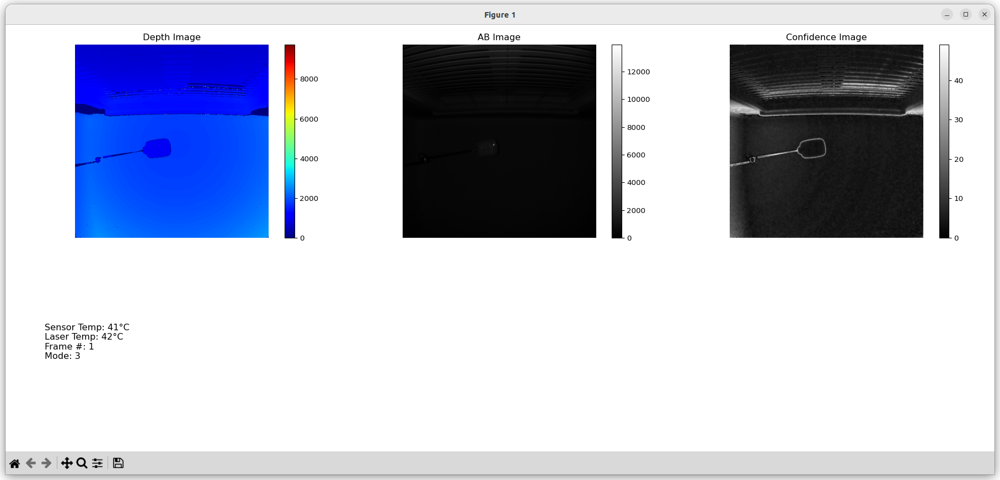](images/first-frame-py.png)

### streaming (Python)

This tool uses Pygame to show streaming frames from the device in real-time.

#### Command Line Interface

```
(aditofpython_env) ~/ADI/Robotics/Camera/ADCAM/0.2.0-a.1/eval/Python$ python depth-image-animation-pygame.py
pygame 2.6.1 (SDL 2.28.4, Python 3.10.12)
Hello from the pygame community. https://www.pygame.org/contribute.html
depth-image-animation-pygame.py usage:
Target: depth-image-animation-pygame.py <mode number>
Network connection: depth-image-animation-pygame.py <mode number> <ip>

For example:
python depth-image-animation-pygame.py 0 192.168.56.1
```

#### Example Usage

```
(aditofpython_env) ~/ADI/Robotics/Camera/ADCAM/0.2.0-a.1/eval/Python$ python depth-image-animation-pygame.py 3
pygame 2.6.1 (SDL 2.28.4, Python 3.10.12)
Hello from the pygame community. https://www.pygame.org/contribute.html
SDK version:  6.2.0  | branch:  main  | commit:  4960f2fb
Looking for camera on Target.
I20251104 10:37:52.586744 3693 sensor_enumerator_nvidia.cpp:109] Looking for sensors on the target
I20251104 10:37:52.590295 3693 buffer_processor.cpp:87] BufferProcessor initialized
I20251104 10:37:52.590429 3693 camera_itof.cpp:105] Sensor name = adsd3500
system.getCameraList() Status.Ok
I20251104 10:37:52.590552 3693 camera_itof.cpp:125] Initializing camera
I20251104 10:37:52.590586 3693 adsd3500_sensor.cpp:243] Opening device
I20251104 10:37:52.590607 3693 adsd3500_sensor.cpp:261] Looking for the following cards:
I20251104 10:37:52.590623 3693 adsd3500_sensor.cpp:263] vi-output, adsd3500
I20251104 10:37:52.590640 3693 adsd3500_sensor.cpp:275] device: /dev/video0     subdevice: /dev/v4l-subdev1
I20251104 10:37:52.591670 3693 adsd3500_sensor.cpp:2039] first reset interrupt. No need to check status register.
I20251104 10:37:52.693371 3693 adsd3500_sensor.cpp:1477] Waiting for ADSD3500 to reset.
I20251104 10:37:52.693451 3693 adsd3500_sensor.cpp:1482] .
I20251104 10:37:53.693589 3693 adsd3500_sensor.cpp:1482] .
I20251104 10:37:54.693815 3693 adsd3500_sensor.cpp:1482] .
I20251104 10:37:55.694236 3693 adsd3500_sensor.cpp:1482] .
I20251104 10:37:56.694677 3693 adsd3500_sensor.cpp:1482] .
I20251104 10:37:57.694916 3693 adsd3500_sensor.cpp:1482] .
I20251104 10:37:58.695155 3693 adsd3500_sensor.cpp:1482] .
I20251104 10:37:59.701553 3693 adsd3500_sensor.cpp:1487] Waited: 7 seconds
I20251104 10:37:59.814133 3693 adsd3500_sensor.cpp:397] ADSD3500 is ready to communicate with.
I20251104 10:37:59.816371 3693 adsd3500_sensor.cpp:1951] CCB master not supported. Using sdk defined modes.
I20251104 10:37:59.834287 3693 camera_itof.cpp:222] Current adsd3500 firmware version is: 7.0.0.0
I20251104 10:37:59.834374 3693 camera_itof.cpp:224] Current adsd3500 firmware git hash is: 140fe63206d9435f2f3c7a050606477e05b70e00
W20251104 10:37:59.834606 3693 camera_itof.cpp:252] fsyncMode is not being set by SDK.
W20251104 10:37:59.834780 3693 camera_itof.cpp:267] mipiSpeed is not being set by SDK.Setting default 2.5Gbps
W20251104 10:37:59.834942 3693 camera_itof.cpp:283] deskew is not being set by SDK, Setting it by default.
W20251104 10:37:59.834964 3693 camera_itof.cpp:295] enableTempCompenstation is not being set by SDK.
W20251104 10:37:59.834978 3693 camera_itof.cpp:305] enableEdgeConfidence is not being set by SDK.
I20251104 10:37:59.841280 3693 camera_itof.cpp:311] Module serial number: 026ao173007q0q4f14
I20251104 10:37:59.841335 3693 camera_itof.cpp:319] Camera initialized
camera1.initialize() Status.Ok
camera1.getAvailableModes() Status.Ok
[0, 1, 2, 3, 6, 5]
camera1.getDetails() Status.Ok
camera1 details: id: /dev/video0 connection: ConnectionType.OnTarget
I20251104 10:37:59.841793 3693 adsd3500_sensor.cpp:243] Opening device
I20251104 10:37:59.841832 3693 adsd3500_sensor.cpp:261] Looking for the following cards:
I20251104 10:37:59.841855 3693 adsd3500_sensor.cpp:263] vi-output, adsd3500
I20251104 10:37:59.841875 3693 adsd3500_sensor.cpp:275] device: /dev/video0     subdevice: /dev/v4l-subdev1
I20251104 10:37:59.846298 3693 buffer_processor.cpp:192] setVideoProperties: Allocating 3 raw frame buffers, each of size 1313280 bytes (total: 3.75732 MB)
I20251104 10:37:59.846467 3693 buffer_processor.cpp:220] setVideoProperties: Allocating 3 ToFi buffers, each of size 4194304 bytes (total: 12 MB)
I20251104 10:38:00.048049 3693 camera_itof.cpp:1845] Camera FPS set from parameter list at: 25
W20251104 10:38:00.048145 3693 camera_itof.cpp:2065] vcselDelay was not found in parameter list, not setting.
W20251104 10:38:00.048696 3693 camera_itof.cpp:2117] enablePhaseInvalidation was not found in parameter list, not setting.
I20251104 10:38:00.048763 3693 camera_itof.cpp:401] Using the following configuration parameters for mode 3
I20251104 10:38:00.048783 3693 camera_itof.cpp:404] abThreshMin : 3.0
I20251104 10:38:00.048798 3693 camera_itof.cpp:404] bitsInAB : 16
I20251104 10:38:00.048811 3693 camera_itof.cpp:404] bitsInConf : 8
I20251104 10:38:00.048824 3693 camera_itof.cpp:404] bitsInPhaseOrDepth : 16
I20251104 10:38:00.048837 3693 camera_itof.cpp:404] confThresh : 25.0
I20251104 10:38:00.048849 3693 camera_itof.cpp:404] depthComputeIspEnable : 1
I20251104 10:38:00.048862 3693 camera_itof.cpp:404] fps : 25
I20251104 10:38:00.048874 3693 camera_itof.cpp:404] headerSize : 128
I20251104 10:38:00.048886 3693 camera_itof.cpp:404] inputFormat : raw8
I20251104 10:38:00.048899 3693 camera_itof.cpp:404] interleavingEnable : 1
I20251104 10:38:00.048912 3693 camera_itof.cpp:404] jblfABThreshold : 10.0
I20251104 10:38:00.048924 3693 camera_itof.cpp:404] jblfApplyFlag : 1
I20251104 10:38:00.048937 3693 camera_itof.cpp:404] jblfExponentialTerm : 5.0
I20251104 10:38:00.048949 3693 camera_itof.cpp:404] jblfGaussianSigma : 10.0
I20251104 10:38:00.048961 3693 camera_itof.cpp:404] jblfMaxEdge : 12.0
I20251104 10:38:00.048974 3693 camera_itof.cpp:404] jblfWindowSize : 7
I20251104 10:38:00.048986 3693 camera_itof.cpp:404] partialDepthEnable : 0
I20251104 10:38:00.048999 3693 camera_itof.cpp:404] phaseInvalid : 0
I20251104 10:38:00.049011 3693 camera_itof.cpp:404] radialThreshMax : 10000.0
I20251104 10:38:00.049023 3693 camera_itof.cpp:404] radialThreshMin : 100.0
I20251104 10:38:00.049035 3693 camera_itof.cpp:404] xyzEnable : 1
I20251104 10:38:00.049185 3693 camera_itof.cpp:414] Metadata in AB is enabled and it is stored in the first 128 bytes.
I20251104 10:38:00.284884 3693 camera_itof.cpp:505] Using closed source depth compute library.
camera1.setMode() Status.Ok
I20251104 10:38:00.422332 3693 adsd3500_sensor.cpp:454] Starting device 0
I20251104 10:38:00.442145 3693 buffer_processor.cpp:733] startThreads: Starting Threads..
camera1.start() Status.Ok
W20251104 10:38:00.738963 3693 buffer_processor.cpp:326] captureFrameThread: No free buffers m_v4l2_input_buffer_Q size: 0
W20251104 10:38:00.742255 3693 buffer_processor.cpp:436] processThread: No new frames, m_captureToProcessQueue Size: 0
I20251104 10:38:00.911284 3693 camera_itof.cpp:637] Dropped first frame
I20251104 10:38:04.988333 3693 buffer_processor.cpp:786] stopThreads: Threads Stopped. Raw buffers freed: 3, ToFi buffers freed: 3
I20251104 10:38:04.988879 3693 adsd3500_sensor.cpp:499] Stopping device
I20251104 10:38:04.992911 3693 adsd3500_sensor.cpp:1521] Waiting for interrupt.
I20251104 10:38:04.992960 3693 adsd3500_sensor.cpp:1526] .
I20251104 10:38:05.013059 3693 adsd3500_sensor.cpp:1526] .
I20251104 10:38:05.035804 3693 adsd3500_sensor.cpp:1531] Waited: 40 ms.
I20251104 10:38:05.035856 3693 adsd3500_sensor.cpp:1538] Got the Interrupt from ADSD3500
I20251104 10:38:05.136029 3693 buffer_processor.cpp:97] freeComputeLibrary
```

[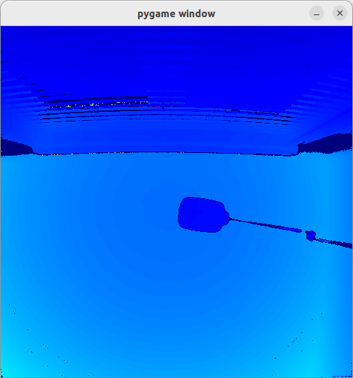](images/depth-image-animation-pygame.png)

## C++ Tools

### first_frame (C++)

#### Command Line Interface
```
(aditofpython_env) ~/ADI/Robotics/Camera/ADCAM/0.2.0-a.1/eval/C++/first-frame$ ./first-frame --m 1
I20251104 10:39:45.205239 3802 main.cpp:151] ADCAM version: 0.2.0-a.1 | SDK version: 6.2.0 | branch: main | commit: 4960f2fb
I20251104 10:39:45.205439 3802 sensor_enumerator_nvidia.cpp:109] Looking for sensors on the target
I20251104 10:39:45.209240 3802 buffer_processor.cpp:87] BufferProcessor initialized
I20251104 10:39:45.209369 3802 camera_itof.cpp:105] Sensor name = adsd3500
I20251104 10:39:45.209408 3802 camera_itof.cpp:125] Initializing camera
I20251104 10:39:45.209435 3802 adsd3500_sensor.cpp:243] Opening device
I20251104 10:39:45.209460 3802 adsd3500_sensor.cpp:261] Looking for the following cards:
I20251104 10:39:45.209477 3802 adsd3500_sensor.cpp:263] vi-output, adsd3500
I20251104 10:39:45.209503 3802 adsd3500_sensor.cpp:275] device: /dev/video0     subdevice: /dev/v4l-subdev1
I20251104 10:39:45.210728 3802 adsd3500_sensor.cpp:2039] first reset interrupt. No need to check status register.
I20251104 10:39:45.312413 3802 adsd3500_sensor.cpp:1477] Waiting for ADSD3500 to reset.
I20251104 10:39:45.312495 3802 adsd3500_sensor.cpp:1482] .
I20251104 10:39:46.312613 3802 adsd3500_sensor.cpp:1482] .
I20251104 10:39:47.312833 3802 adsd3500_sensor.cpp:1482] .
I20251104 10:39:48.313084 3802 adsd3500_sensor.cpp:1482] .
I20251104 10:39:49.313322 3802 adsd3500_sensor.cpp:1482] .
I20251104 10:39:50.313547 3802 adsd3500_sensor.cpp:1482] .
I20251104 10:39:51.313789 3802 adsd3500_sensor.cpp:1482] .
I20251104 10:39:51.713649 3802 main.cpp:191] Running the callback for which the status of ADSD3500 has been forwarded. ADSD3500 status = Adsd3500Status::OK
I20251104 10:39:51.716246 3802 main.cpp:191] Running the callback for which the status of ADSD3500 has been forwarded. ADSD3500 status = Adsd3500Status::OK
I20251104 10:39:52.319821 3802 adsd3500_sensor.cpp:1487] Waited: 7 seconds
I20251104 10:39:52.432339 3802 adsd3500_sensor.cpp:397] ADSD3500 is ready to communicate with.
I20251104 10:39:52.434045 3802 adsd3500_sensor.cpp:1951] CCB master not supported. Using sdk defined modes.
I20251104 10:39:52.451789 3802 camera_itof.cpp:222] Current adsd3500 firmware version is: 7.0.0.0
I20251104 10:39:52.451866 3802 camera_itof.cpp:224] Current adsd3500 firmware git hash is: 140fe63206d9435f2f3c7a050606477e05b70e00
W20251104 10:39:52.452078 3802 camera_itof.cpp:252] fsyncMode is not being set by SDK.
W20251104 10:39:52.452265 3802 camera_itof.cpp:267] mipiSpeed is not being set by SDK.Setting default 2.5Gbps
W20251104 10:39:52.452496 3802 camera_itof.cpp:283] deskew is not being set by SDK, Setting it by default.
W20251104 10:39:52.452532 3802 camera_itof.cpp:295] enableTempCompenstation is not being set by SDK.
W20251104 10:39:52.452556 3802 camera_itof.cpp:305] enableEdgeConfidence is not being set by SDK.
I20251104 10:39:52.458756 3802 camera_itof.cpp:311] Module serial number: 026ao173007q0q4f14
I20251104 10:39:52.458782 3802 camera_itof.cpp:319] Camera initialized
I20251104 10:39:52.458946 3802 adsd3500_sensor.cpp:243] Opening device
I20251104 10:39:52.458978 3802 adsd3500_sensor.cpp:261] Looking for the following cards:
I20251104 10:39:52.458995 3802 adsd3500_sensor.cpp:263] vi-output, adsd3500
I20251104 10:39:52.459010 3802 adsd3500_sensor.cpp:275] device: /dev/video0     subdevice: /dev/v4l-subdev1
I20251104 10:39:52.468513 3802 buffer_processor.cpp:192] setVideoProperties: Allocating 3 raw frame buffers, each of size 4195328 bytes (total: 12.0029 MB)
I20251104 10:39:52.468726 3802 buffer_processor.cpp:220] setVideoProperties: Allocating 3 ToFi buffers, each of size 16777216 bytes (total: 48 MB)
I20251104 10:39:52.670616 3802 camera_itof.cpp:1845] Camera FPS set from parameter list at: 10
W20251104 10:39:52.670716 3802 camera_itof.cpp:2065] vcselDelay was not found in parameter list, not setting.
W20251104 10:39:52.671260 3802 camera_itof.cpp:2117] enablePhaseInvalidation was not found in parameter list, not setting.
I20251104 10:39:52.671315 3802 camera_itof.cpp:401] Using the following configuration parameters for mode 1
I20251104 10:39:52.671332 3802 camera_itof.cpp:404] abThreshMin : 3.0
I20251104 10:39:52.671344 3802 camera_itof.cpp:404] bitsInAB : 16
I20251104 10:39:52.671355 3802 camera_itof.cpp:404] bitsInConf : 0
I20251104 10:39:52.671365 3802 camera_itof.cpp:404] bitsInPhaseOrDepth : 16
I20251104 10:39:52.671376 3802 camera_itof.cpp:404] confThresh : 25.0
I20251104 10:39:52.671386 3802 camera_itof.cpp:404] depthComputeIspEnable : 1
I20251104 10:39:52.671397 3802 camera_itof.cpp:404] fps : 10
I20251104 10:39:52.671408 3802 camera_itof.cpp:404] headerSize : 128
I20251104 10:39:52.671418 3802 camera_itof.cpp:404] inputFormat : mipiRaw12_8
I20251104 10:39:52.671428 3802 camera_itof.cpp:404] interleavingEnable : 0
I20251104 10:39:52.671439 3802 camera_itof.cpp:404] jblfABThreshold : 10.0
I20251104 10:39:52.671488 3802 camera_itof.cpp:404] jblfApplyFlag : 1
I20251104 10:39:52.671508 3802 camera_itof.cpp:404] jblfExponentialTerm : 5.0
I20251104 10:39:52.671523 3802 camera_itof.cpp:404] jblfGaussianSigma : 10.0
I20251104 10:39:52.671535 3802 camera_itof.cpp:404] jblfMaxEdge : 12.0
I20251104 10:39:52.671546 3802 camera_itof.cpp:404] jblfWindowSize : 7
I20251104 10:39:52.671561 3802 camera_itof.cpp:404] partialDepthEnable : 1
I20251104 10:39:52.671573 3802 camera_itof.cpp:404] phaseInvalid : 0
I20251104 10:39:52.671587 3802 camera_itof.cpp:404] radialThreshMax : 10000.0
I20251104 10:39:52.671600 3802 camera_itof.cpp:404] radialThreshMin : 100.0
I20251104 10:39:52.671613 3802 camera_itof.cpp:404] xyzEnable : 1
I20251104 10:39:52.671790 3802 camera_itof.cpp:414] Metadata in AB is enabled and it is stored in the first 128 bytes.
I20251104 10:39:53.540790 3802 camera_itof.cpp:505] Using closed source depth compute library.
I20251104 10:39:54.088028 3802 adsd3500_sensor.cpp:454] Starting device 0
I20251104 10:39:54.111209 3802 buffer_processor.cpp:733] startThreads: Starting Threads..
I20251104 10:39:54.166047 3802 camera_itof.cpp:637] Dropped first frame
I20251104 10:39:54.261605 3802 main.cpp:248] succesfully requested frame!
I20251104 10:39:55.070234 3802 buffer_processor.cpp:786] stopThreads: Threads Stopped. Raw buffers freed: 3, ToFi buffers freed: 3
I20251104 10:39:55.071239 3802 adsd3500_sensor.cpp:499] Stopping device
I20251104 10:39:55.075277 3802 adsd3500_sensor.cpp:1521] Waiting for interrupt.
I20251104 10:39:55.075350 3802 adsd3500_sensor.cpp:1526] .
I20251104 10:39:55.095478 3802 adsd3500_sensor.cpp:1526] .
I20251104 10:39:55.103091 3802 main.cpp:191] Running the callback for which the status of ADSD3500 has been forwarded. ADSD3500 status = Adsd3500Status::IMAGER_STREAM_OFF
I20251104 10:39:55.118264 3802 adsd3500_sensor.cpp:1531] Waited: 40 ms.
I20251104 10:39:55.118307 3802 adsd3500_sensor.cpp:1538] Got the Interrupt from ADSD3500
I20251104 10:39:55.118338 3802 camera_itof.cpp:1943] No chip/imager errors detected.
I20251104 10:39:55.118364 3802 main.cpp:268] Chip status error code: 41
I20251104 10:39:55.118388 3802 main.cpp:269] Imager status error code: 0
I20251104 10:39:55.118415 3802 main.cpp:278] Sensor Temperature: 36
I20251104 10:39:55.118440 3802 main.cpp:279] Laser Temperature: 37
I20251104 10:39:55.118463 3802 main.cpp:280] Frame Number: 1
I20251104 10:39:55.118487 3802 main.cpp:281] Mode: 1
I20251104 10:39:55.121740 3802 buffer_processor.cpp:97] freeComputeLibrary
```

Two files should have been generated:
* out_ab_mode_1.bin  
* out_depth_mode_1.bin

Note, for visualzation, it is assumed that the Python environment is still active.

To visualize the AB output:
```
(aditofpython_env) ~/ADI/Robotics/Camera/ADCAM/0.2.0-a.1/eval/C++/first-frame$ python ../../../tools/visualization/visualize_ab.py out_ab_mode_1.bin 1024 1024
Input file is:  out_ab_mode_1.bin

```

[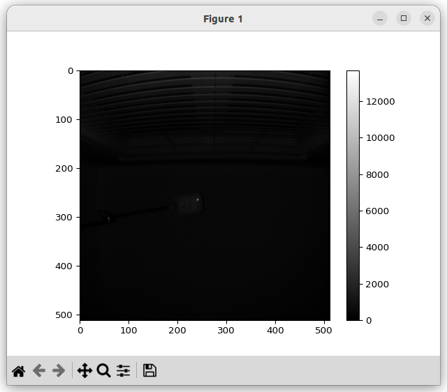](images/first-frame-c++-visualize-ab.png)

To visualize the depth output:
```
aditofpython_env) ~/ADI/Robotics/Camera/ADCAM/0.2.0-a.1/eval/C++/first-frame$ python ../../../tools/visualization/visualize_depth.py out_depth_mode_1.bin 1024 1024
Input file is:  out_depth_mode_1.bin
```

[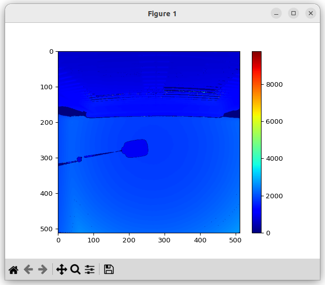](images/first-frame-c++-visualize-depth.png)

### data_collect (C++)

**data_collect** is use save a stream of frames to the file system of the host computer. 

#### Command Line Interface
```
(aditofpython_env) ~/ADI/Robotics/Camera/ADCAM/0.2.0-a.1/eval/C++/data_collect$ ./data_collect -h
Data Collect.
    Usage:
      data_collect
      data_collect [--f <folder>] [--n <ncapture>] [--m <mode>] [--wt <warmup>] [--ccb FILE] [--ip <ip>] [--fw <firmware>] [-s | --split] [-t | --netlinktest] [--ic <imager-configuration>] [-scf <save-configuration-file>] [-lcf <load-configuration-file>]
      data_collect (-h | --help)

    Options:
      -h --help          Show this screen.
      --f <folder>       Output folder (max name 512) [default: ./]
      --n <ncapture>     Capture frame num. [default: 1]
      --m <mode>         Mode to capture data in. [default: 0]
      --wt <warmup>      Warmup Time (sec) [default: 0]
      --ccb <FILE>       The path to store CCB content
      --ip <ip>          Camera IP
      --fw <firmware>    Adsd3500 fw file
      --split            Save each frame into a separate file (Debug)
      --netlinktest      Puts server on target in test mode (Debug)
      --singlethread     Store the frame to file using same tread
      --ic <imager-configuration>   Select imager configuration: standard, standard-raw,
                         custom, custom-raw. By default is standard.
      --scf <save-configuration-file>    Save current configuration to json file
      --lcf <load-configuration-file>    Load configuration from json file

    Note: --m argument supports index (0, 1, etc.)

    Valid mode (--m) options are:
        0: short-range native
        1: long-range native
        2: short-range Qnative
        3: long-range Qnative
        4: pcm-native
        5: long-range mixed
        6: short-range mixed
```

#### Example 1: Basic Usage
* *--f output*: Place captured data into the folder *output*.
* *--m 1*: Use mode 1.
* *--n 100*: Capture 100 frames.
   
```
(aditofpython_env) ~/ADI/Robotics/Camera/ADCAM/0.2.0-a.1/eval/C++/data_collect$ ./data_collect --f output --m 1 --n 100
I20251104 10:42:49.255032 3861 main.cpp:171] ADCAM version: 0.2.0-a.1 | SDK version: 6.2.0 | branch: main | commit: 4960f2fb
I20251104 10:42:49.255436 3861 main.cpp:288] Output folder: output
I20251104 10:42:49.255491 3861 main.cpp:289] Mode: 1
I20251104 10:42:49.255512 3861 main.cpp:290] Number of frames: 100
I20251104 10:42:49.255532 3861 main.cpp:291] Json file:
I20251104 10:42:49.255548 3861 main.cpp:292] Warm Up Time is: 0 seconds
I20251104 10:42:49.255564 3861 main.cpp:293] Configuration is: standard
I20251104 10:42:49.255589 3861 sensor_enumerator_nvidia.cpp:109] Looking for sensors on the target
I20251104 10:42:49.259436 3861 buffer_processor.cpp:87] BufferProcessor initialized
I20251104 10:42:49.259602 3861 camera_itof.cpp:105] Sensor name = adsd3500
I20251104 10:42:49.259636 3861 camera_itof.cpp:125] Initializing camera
I20251104 10:42:49.259664 3861 adsd3500_sensor.cpp:243] Opening device
I20251104 10:42:49.259688 3861 adsd3500_sensor.cpp:261] Looking for the following cards:
I20251104 10:42:49.259705 3861 adsd3500_sensor.cpp:263] vi-output, adsd3500
I20251104 10:42:49.259723 3861 adsd3500_sensor.cpp:275] device: /dev/video0     subdevice: /dev/v4l-subdev1
I20251104 10:42:49.261230 3861 adsd3500_sensor.cpp:2039] first reset interrupt. No need to check status register.
I20251104 10:42:49.363023 3861 adsd3500_sensor.cpp:1477] Waiting for ADSD3500 to reset.
I20251104 10:42:49.363105 3861 adsd3500_sensor.cpp:1482] .
I20251104 10:42:50.363230 3861 adsd3500_sensor.cpp:1482] .
I20251104 10:42:51.363498 3861 adsd3500_sensor.cpp:1482] .
I20251104 10:42:52.363725 3861 adsd3500_sensor.cpp:1482] .
I20251104 10:42:53.363959 3861 adsd3500_sensor.cpp:1482] .
I20251104 10:42:54.364176 3861 adsd3500_sensor.cpp:1482] .
I20251104 10:42:55.364397 3861 adsd3500_sensor.cpp:1482] .
I20251104 10:42:56.369934 3861 adsd3500_sensor.cpp:1487] Waited: 7 seconds
I20251104 10:42:56.482188 3861 adsd3500_sensor.cpp:397] ADSD3500 is ready to communicate with.
I20251104 10:42:56.483911 3861 adsd3500_sensor.cpp:1951] CCB master not supported. Using sdk defined modes.
I20251104 10:42:56.501526 3861 camera_itof.cpp:222] Current adsd3500 firmware version is: 7.0.0.0
I20251104 10:42:56.501631 3861 camera_itof.cpp:224] Current adsd3500 firmware git hash is: 140fe63206d9435f2f3c7a050606477e05b70e00
W20251104 10:42:56.502011 3861 camera_itof.cpp:252] fsyncMode is not being set by SDK.
W20251104 10:42:56.502269 3861 camera_itof.cpp:267] mipiSpeed is not being set by SDK.Setting default 2.5Gbps
W20251104 10:42:56.502432 3861 camera_itof.cpp:283] deskew is not being set by SDK, Setting it by default.
W20251104 10:42:56.502454 3861 camera_itof.cpp:295] enableTempCompenstation is not being set by SDK.
W20251104 10:42:56.502468 3861 camera_itof.cpp:305] enableEdgeConfidence is not being set by SDK.
I20251104 10:42:56.508663 3861 camera_itof.cpp:311] Module serial number: 026ao173007q0q4f14
I20251104 10:42:56.508704 3861 camera_itof.cpp:319] Camera initialized
I20251104 10:42:56.508737 3861 adsd3500_sensor.cpp:2097] Using sensor configuration: standard
I20251104 10:42:56.508768 3861 main.cpp:337] Configure camera with standard
I20251104 10:42:56.508973 3861 adsd3500_sensor.cpp:243] Opening device
I20251104 10:42:56.509015 3861 adsd3500_sensor.cpp:261] Looking for the following cards:
I20251104 10:42:56.509043 3861 adsd3500_sensor.cpp:263] vi-output, adsd3500
I20251104 10:42:56.509068 3861 adsd3500_sensor.cpp:275] device: /dev/video0     subdevice: /dev/v4l-subdev1
I20251104 10:42:56.518463 3861 buffer_processor.cpp:192] setVideoProperties: Allocating 3 raw frame buffers, each of size 4195328 bytes (total: 12.0029 MB)
I20251104 10:42:56.518691 3861 buffer_processor.cpp:220] setVideoProperties: Allocating 3 ToFi buffers, each of size 16777216 bytes (total: 48 MB)
I20251104 10:42:56.721508 3861 camera_itof.cpp:1845] Camera FPS set from parameter list at: 10
W20251104 10:42:56.721602 3861 camera_itof.cpp:2065] vcselDelay was not found in parameter list, not setting.
W20251104 10:42:56.722672 3861 camera_itof.cpp:2117] enablePhaseInvalidation was not found in parameter list, not setting.
I20251104 10:42:56.722796 3861 camera_itof.cpp:401] Using the following configuration parameters for mode 1
I20251104 10:42:56.722837 3861 camera_itof.cpp:404] abThreshMin : 3.0
I20251104 10:42:56.722864 3861 camera_itof.cpp:404] bitsInAB : 16
I20251104 10:42:56.722888 3861 camera_itof.cpp:404] bitsInConf : 0
I20251104 10:42:56.722910 3861 camera_itof.cpp:404] bitsInPhaseOrDepth : 16
I20251104 10:42:56.722937 3861 camera_itof.cpp:404] confThresh : 25.0
I20251104 10:42:56.722959 3861 camera_itof.cpp:404] depthComputeIspEnable : 1
I20251104 10:42:56.722981 3861 camera_itof.cpp:404] fps : 10
I20251104 10:42:56.723002 3861 camera_itof.cpp:404] headerSize : 128
I20251104 10:42:56.723023 3861 camera_itof.cpp:404] inputFormat : mipiRaw12_8
I20251104 10:42:56.723045 3861 camera_itof.cpp:404] interleavingEnable : 0
I20251104 10:42:56.723067 3861 camera_itof.cpp:404] jblfABThreshold : 10.0
I20251104 10:42:56.723088 3861 camera_itof.cpp:404] jblfApplyFlag : 1
I20251104 10:42:56.723109 3861 camera_itof.cpp:404] jblfExponentialTerm : 5.0
I20251104 10:42:56.723130 3861 camera_itof.cpp:404] jblfGaussianSigma : 10.0
I20251104 10:42:56.723151 3861 camera_itof.cpp:404] jblfMaxEdge : 12.0
I20251104 10:42:56.723173 3861 camera_itof.cpp:404] jblfWindowSize : 7
I20251104 10:42:56.723195 3861 camera_itof.cpp:404] partialDepthEnable : 1
I20251104 10:42:56.723217 3861 camera_itof.cpp:404] phaseInvalid : 0
I20251104 10:42:56.723239 3861 camera_itof.cpp:404] radialThreshMax : 10000.0
I20251104 10:42:56.723261 3861 camera_itof.cpp:404] radialThreshMin : 100.0
I20251104 10:42:56.723283 3861 camera_itof.cpp:404] xyzEnable : 1
I20251104 10:42:56.723518 3861 camera_itof.cpp:414] Metadata in AB is enabled and it is stored in the first 128 bytes.
I20251104 10:42:57.597595 3861 camera_itof.cpp:505] Using closed source depth compute library.
I20251104 10:42:58.142517 3861 adsd3500_sensor.cpp:454] Starting device 0
I20251104 10:42:58.162884 3861 buffer_processor.cpp:733] startThreads: Starting Threads..
I20251104 10:42:58.216515 3861 camera_itof.cpp:637] Dropped first frame
I20251104 10:42:58.310869 3861 main.cpp:467] Requesting 100 frames!
I20251104 10:43:08.309485 3861 main.cpp:492] Measured FPS: 10.0015
I20251104 10:43:09.111090 3861 buffer_processor.cpp:786] stopThreads: Threads Stopped. Raw buffers freed: 3, ToFi buffers freed: 3
I20251104 10:43:09.111797 3861 adsd3500_sensor.cpp:499] Stopping device
I20251104 10:43:09.115726 3861 adsd3500_sensor.cpp:1521] Waiting for interrupt.
I20251104 10:43:09.115791 3861 adsd3500_sensor.cpp:1526] .
I20251104 10:43:09.135910 3861 adsd3500_sensor.cpp:1526] .
I20251104 10:43:09.158830 3861 adsd3500_sensor.cpp:1531] Waited: 40 ms.
I20251104 10:43:09.158921 3861 adsd3500_sensor.cpp:1538] Got the Interrupt from ADSD3500
I20251104 10:43:09.161765 3861 buffer_processor.cpp:97] freeComputeLibrary
```

#### Example 2: Saving Configuration Data to JSON
* *--scf saved_cfg.json*: Save the device configuration file to *saved_cfg.json*.
```
(aditofpython_env) ~/ADI/Robotics/Camera/ADCAM/0.2.0-a.1/eval/C++/data_collect$ ./data_collect --scf saved_cfg.json
I20251104 10:44:15.057058 3998 main.cpp:171] ADCAM version: 0.2.0-a.1 | SDK version: 6.2.0 | branch: main | commit: 4960f2fb
I20251104 10:44:15.057271 3998 main.cpp:288] Output folder: .
I20251104 10:44:15.057296 3998 main.cpp:289] Mode: 0
I20251104 10:44:15.057312 3998 main.cpp:290] Number of frames: 0
I20251104 10:44:15.057329 3998 main.cpp:291] Json file:
I20251104 10:44:15.057343 3998 main.cpp:292] Warm Up Time is: 0 seconds
I20251104 10:44:15.057357 3998 main.cpp:293] Configuration is: standard
I20251104 10:44:15.057379 3998 sensor_enumerator_nvidia.cpp:109] Looking for sensors on the target
I20251104 10:44:15.061012 3998 buffer_processor.cpp:87] BufferProcessor initialized
I20251104 10:44:15.061140 3998 camera_itof.cpp:105] Sensor name = adsd3500
I20251104 10:44:15.061172 3998 camera_itof.cpp:125] Initializing camera
I20251104 10:44:15.061197 3998 adsd3500_sensor.cpp:243] Opening device
I20251104 10:44:15.061221 3998 adsd3500_sensor.cpp:261] Looking for the following cards:
I20251104 10:44:15.061237 3998 adsd3500_sensor.cpp:263] vi-output, adsd3500
I20251104 10:44:15.061254 3998 adsd3500_sensor.cpp:275] device: /dev/video0     subdevice: /dev/v4l-subdev1
I20251104 10:44:15.062426 3998 adsd3500_sensor.cpp:2039] first reset interrupt. No need to check status register.
I20251104 10:44:15.164019 3998 adsd3500_sensor.cpp:1477] Waiting for ADSD3500 to reset.
I20251104 10:44:15.164092 3998 adsd3500_sensor.cpp:1482] .
I20251104 10:44:16.164214 3998 adsd3500_sensor.cpp:1482] .
I20251104 10:44:17.164455 3998 adsd3500_sensor.cpp:1482] .
I20251104 10:44:18.164690 3998 adsd3500_sensor.cpp:1482] .
I20251104 10:44:19.164925 3998 adsd3500_sensor.cpp:1482] .
I20251104 10:44:20.165160 3998 adsd3500_sensor.cpp:1482] .
I20251104 10:44:21.165416 3998 adsd3500_sensor.cpp:1482] .
I20251104 10:44:22.170726 3998 adsd3500_sensor.cpp:1487] Waited: 7 seconds
I20251104 10:44:22.282931 3998 adsd3500_sensor.cpp:397] ADSD3500 is ready to communicate with.
I20251104 10:44:22.284656 3998 adsd3500_sensor.cpp:1951] CCB master not supported. Using sdk defined modes.
I20251104 10:44:22.302218 3998 camera_itof.cpp:222] Current adsd3500 firmware version is: 7.0.0.0
I20251104 10:44:22.302333 3998 camera_itof.cpp:224] Current adsd3500 firmware git hash is: 140fe63206d9435f2f3c7a050606477e05b70e00
W20251104 10:44:22.302678 3998 camera_itof.cpp:252] fsyncMode is not being set by SDK.
W20251104 10:44:22.302965 3998 camera_itof.cpp:267] mipiSpeed is not being set by SDK.Setting default 2.5Gbps
W20251104 10:44:22.303193 3998 camera_itof.cpp:283] deskew is not being set by SDK, Setting it by default.
W20251104 10:44:22.303229 3998 camera_itof.cpp:295] enableTempCompenstation is not being set by SDK.
W20251104 10:44:22.303254 3998 camera_itof.cpp:305] enableEdgeConfidence is not being set by SDK.
I20251104 10:44:22.309684 3998 camera_itof.cpp:311] Module serial number: 026ao173007q0q4f14
I20251104 10:44:22.309728 3998 camera_itof.cpp:319] Camera initialized
I20251104 10:44:22.309754 3998 adsd3500_sensor.cpp:2097] Using sensor configuration: standard
I20251104 10:44:22.309771 3998 main.cpp:337] Configure camera with standard
I20251104 10:44:22.310450 3998 main.cpp:346] Current configuration info saved to file saved_cfg.json
I20251104 10:44:22.310617 3998 adsd3500_sensor.cpp:243] Opening device
I20251104 10:44:22.310645 3998 adsd3500_sensor.cpp:261] Looking for the following cards:
I20251104 10:44:22.310662 3998 adsd3500_sensor.cpp:263] vi-output, adsd3500
I20251104 10:44:22.310676 3998 adsd3500_sensor.cpp:275] device: /dev/video0     subdevice: /dev/v4l-subdev1
I20251104 10:44:22.319629 3998 buffer_processor.cpp:192] setVideoProperties: Allocating 3 raw frame buffers, each of size 4195328 bytes (total: 12.0029 MB)
I20251104 10:44:22.319933 3998 buffer_processor.cpp:220] setVideoProperties: Allocating 3 ToFi buffers, each of size 16777216 bytes (total: 48 MB)
I20251104 10:44:22.522530 3998 camera_itof.cpp:1845] Camera FPS set from parameter list at: 10
W20251104 10:44:22.522617 3998 camera_itof.cpp:2065] vcselDelay was not found in parameter list, not setting.
W20251104 10:44:22.523226 3998 camera_itof.cpp:2117] enablePhaseInvalidation was not found in parameter list, not setting.
I20251104 10:44:22.523313 3998 camera_itof.cpp:401] Using the following configuration parameters for mode 0
I20251104 10:44:22.523347 3998 camera_itof.cpp:404] abThreshMin : 3.0
I20251104 10:44:22.523374 3998 camera_itof.cpp:404] bitsInAB : 16
I20251104 10:44:22.523397 3998 camera_itof.cpp:404] bitsInConf : 0
I20251104 10:44:22.523419 3998 camera_itof.cpp:404] bitsInPhaseOrDepth : 16
I20251104 10:44:22.523444 3998 camera_itof.cpp:404] confThresh : 25.0
I20251104 10:44:22.523497 3998 camera_itof.cpp:404] depthComputeIspEnable : 1
I20251104 10:44:22.523521 3998 camera_itof.cpp:404] fps : 10
I20251104 10:44:22.523544 3998 camera_itof.cpp:404] headerSize : 128
I20251104 10:44:22.523567 3998 camera_itof.cpp:404] inputFormat : mipiRaw12_8
I20251104 10:44:22.523589 3998 camera_itof.cpp:404] interleavingEnable : 0
I20251104 10:44:22.523610 3998 camera_itof.cpp:404] jblfABThreshold : 10.0
I20251104 10:44:22.523633 3998 camera_itof.cpp:404] jblfApplyFlag : 1
I20251104 10:44:22.523655 3998 camera_itof.cpp:404] jblfExponentialTerm : 5.0
I20251104 10:44:22.523678 3998 camera_itof.cpp:404] jblfGaussianSigma : 10.0
I20251104 10:44:22.523698 3998 camera_itof.cpp:404] jblfMaxEdge : 12.0
I20251104 10:44:22.523719 3998 camera_itof.cpp:404] jblfWindowSize : 7
I20251104 10:44:22.523740 3998 camera_itof.cpp:404] partialDepthEnable : 1
I20251104 10:44:22.523760 3998 camera_itof.cpp:404] phaseInvalid : 0
I20251104 10:44:22.523781 3998 camera_itof.cpp:404] radialThreshMax : 10000.0
I20251104 10:44:22.523801 3998 camera_itof.cpp:404] radialThreshMin : 100.0
I20251104 10:44:22.523822 3998 camera_itof.cpp:404] xyzEnable : 1
I20251104 10:44:22.524033 3998 camera_itof.cpp:414] Metadata in AB is enabled and it is stored in the first 128 bytes.
I20251104 10:44:23.399056 3998 camera_itof.cpp:505] Using closed source depth compute library.
I20251104 10:44:23.943949 3998 main.cpp:423] 0 frames requested, exiting.
I20251104 10:44:23.947535 3998 buffer_processor.cpp:97] freeComputeLibrary
(aditofpython_env) ~/ADI/Robotics/Camera/ADCAM/0.2.0-a.1/eval/C++/data_collect$ ls saved_cfg.json
saved_cfg.json
```

#### Example 3: Loading Configuration Data from JSON

In this example we will use the JSON file to change the frame rate for mode 1 to 5fps.

[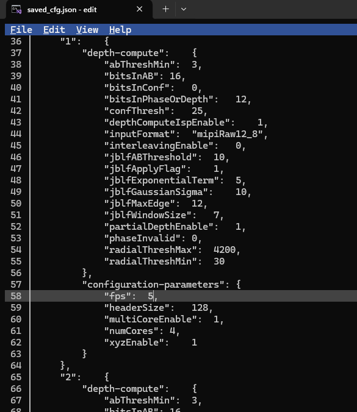](images/data_collect_example_3_fps_change.png)

* *--f output*: Place captured data into the folder *output*.
* *--m 1*: Use mode 1.
* *--n 100*: Capture 100 frames.
* *--lcf saved_cfg.json*: Used the device configuration file *saved_cfg.json*.
```
(aditofpython_env) ~/ADI/Robotics/Camera/ADCAM/0.2.0-a.1/eval/C++/data_collect$ ./data_collect --f output --m 1 --n 100 --lcf saved_cfg.json
I20251104 10:50:57.358917 4308 main.cpp:171] ADCAM version: 0.2.0-a.1 | SDK version: 6.2.0 | branch: main | commit: 4960f2fb
I20251104 10:50:57.359139 4308 main.cpp:288] Output folder: output
I20251104 10:50:57.359170 4308 main.cpp:289] Mode: 1
I20251104 10:50:57.359188 4308 main.cpp:290] Number of frames: 100
I20251104 10:50:57.359206 4308 main.cpp:291] Json file: saved_cfg.json
I20251104 10:50:57.359222 4308 main.cpp:292] Warm Up Time is: 0 seconds
I20251104 10:50:57.359237 4308 main.cpp:293] Configuration is: standard
I20251104 10:50:57.359261 4308 sensor_enumerator_nvidia.cpp:109] Looking for sensors on the target
I20251104 10:50:57.362727 4308 buffer_processor.cpp:87] BufferProcessor initialized
I20251104 10:50:57.362854 4308 camera_itof.cpp:105] Sensor name = adsd3500
I20251104 10:50:57.362888 4308 camera_itof.cpp:125] Initializing camera
I20251104 10:50:57.362916 4308 adsd3500_sensor.cpp:243] Opening device
I20251104 10:50:57.362940 4308 adsd3500_sensor.cpp:261] Looking for the following cards:
I20251104 10:50:57.362957 4308 adsd3500_sensor.cpp:263] vi-output, adsd3500
I20251104 10:50:57.362975 4308 adsd3500_sensor.cpp:275] device: /dev/video0     subdevice: /dev/v4l-subdev1
I20251104 10:50:57.364202 4308 adsd3500_sensor.cpp:2039] first reset interrupt. No need to check status register.
I20251104 10:50:57.465902 4308 adsd3500_sensor.cpp:1477] Waiting for ADSD3500 to reset.
I20251104 10:50:57.465990 4308 adsd3500_sensor.cpp:1482] .
I20251104 10:50:58.466125 4308 adsd3500_sensor.cpp:1482] .
I20251104 10:50:59.466367 4308 adsd3500_sensor.cpp:1482] .
I20251104 10:51:00.466616 4308 adsd3500_sensor.cpp:1482] .
I20251104 10:51:01.466862 4308 adsd3500_sensor.cpp:1482] .
I20251104 10:51:02.467111 4308 adsd3500_sensor.cpp:1482] .
I20251104 10:51:03.467357 4308 adsd3500_sensor.cpp:1482] .
I20251104 10:51:04.473125 4308 adsd3500_sensor.cpp:1487] Waited: 7 seconds
I20251104 10:51:04.585269 4308 adsd3500_sensor.cpp:397] ADSD3500 is ready to communicate with.
I20251104 10:51:04.587012 4308 adsd3500_sensor.cpp:1951] CCB master not supported. Using sdk defined modes.
I20251104 10:51:04.604665 4308 camera_itof.cpp:222] Current adsd3500 firmware version is: 7.0.0.0
I20251104 10:51:04.604777 4308 camera_itof.cpp:224] Current adsd3500 firmware git hash is: 140fe63206d9435f2f3c7a050606477e05b70e00
W20251104 10:51:04.605649 4308 camera_itof.cpp:252] fsyncMode is not being set by SDK.
W20251104 10:51:04.605911 4308 camera_itof.cpp:267] mipiSpeed is not being set by SDK.Setting default 2.5Gbps
W20251104 10:51:04.606087 4308 camera_itof.cpp:283] deskew is not being set by SDK, Setting it by default.
W20251104 10:51:04.606112 4308 camera_itof.cpp:295] enableTempCompenstation is not being set by SDK.
W20251104 10:51:04.606125 4308 camera_itof.cpp:305] enableEdgeConfidence is not being set by SDK.
I20251104 10:51:04.612325 4308 camera_itof.cpp:311] Module serial number: 026ao173007q0q4f14
I20251104 10:51:04.612368 4308 camera_itof.cpp:319] Camera initialized
I20251104 10:51:04.612397 4308 adsd3500_sensor.cpp:2097] Using sensor configuration: standard
I20251104 10:51:04.612419 4308 main.cpp:337] Configure camera with standard
I20251104 10:51:04.612614 4308 adsd3500_sensor.cpp:243] Opening device
I20251104 10:51:04.612663 4308 adsd3500_sensor.cpp:261] Looking for the following cards:
I20251104 10:51:04.612694 4308 adsd3500_sensor.cpp:263] vi-output, adsd3500
I20251104 10:51:04.612720 4308 adsd3500_sensor.cpp:275] device: /dev/video0     subdevice: /dev/v4l-subdev1
I20251104 10:51:04.621908 4308 buffer_processor.cpp:192] setVideoProperties: Allocating 3 raw frame buffers, each of size 4195328 bytes (total: 12.0029 MB)
I20251104 10:51:04.622099 4308 buffer_processor.cpp:220] setVideoProperties: Allocating 3 ToFi buffers, each of size 16777216 bytes (total: 48 MB)
I20251104 10:51:04.823630 4308 camera_itof.cpp:1845] Camera FPS set from parameter list at: 5
W20251104 10:51:04.823723 4308 camera_itof.cpp:2065] vcselDelay was not found in parameter list, not setting.
W20251104 10:51:04.824276 4308 camera_itof.cpp:2117] enablePhaseInvalidation was not found in parameter list, not setting.
I20251104 10:51:04.824332 4308 camera_itof.cpp:401] Using the following configuration parameters for mode 1
I20251104 10:51:04.824350 4308 camera_itof.cpp:404] abThreshMin : 3
I20251104 10:51:04.824365 4308 camera_itof.cpp:404] bitsInAB : 16
I20251104 10:51:04.824377 4308 camera_itof.cpp:404] bitsInConf : 0
I20251104 10:51:04.824389 4308 camera_itof.cpp:404] bitsInPhaseOrDepth : 16
I20251104 10:51:04.824401 4308 camera_itof.cpp:404] confThresh : 25
I20251104 10:51:04.824413 4308 camera_itof.cpp:404] depthComputeIspEnable : 1
I20251104 10:51:04.824425 4308 camera_itof.cpp:404] fps : 5
I20251104 10:51:04.824437 4308 camera_itof.cpp:404] headerSize : 128
I20251104 10:51:04.824449 4308 camera_itof.cpp:404] inputFormat : mipiRaw12_8
I20251104 10:51:04.824461 4308 camera_itof.cpp:404] interleavingEnable : 0
I20251104 10:51:04.824473 4308 camera_itof.cpp:404] jblfABThreshold : 10
I20251104 10:51:04.824484 4308 camera_itof.cpp:404] jblfApplyFlag : 1
I20251104 10:51:04.824496 4308 camera_itof.cpp:404] jblfExponentialTerm : 5
I20251104 10:51:04.824507 4308 camera_itof.cpp:404] jblfGaussianSigma : 10
I20251104 10:51:04.824519 4308 camera_itof.cpp:404] jblfMaxEdge : 12
I20251104 10:51:04.824531 4308 camera_itof.cpp:404] jblfWindowSize : 7
I20251104 10:51:04.824542 4308 camera_itof.cpp:404] partialDepthEnable : 1
I20251104 10:51:04.824554 4308 camera_itof.cpp:404] phaseInvalid : 0
I20251104 10:51:04.824566 4308 camera_itof.cpp:404] radialThreshMax : 10000
I20251104 10:51:04.824577 4308 camera_itof.cpp:404] radialThreshMin : 100
I20251104 10:51:04.824590 4308 camera_itof.cpp:404] xyzEnable : 1
I20251104 10:51:04.824739 4308 camera_itof.cpp:414] Metadata in AB is enabled and it is stored in the first 128 bytes.
I20251104 10:51:05.707667 4308 camera_itof.cpp:505] Using closed source depth compute library.
I20251104 10:51:06.258074 4308 adsd3500_sensor.cpp:454] Starting device 0
I20251104 10:51:06.279089 4308 buffer_processor.cpp:733] startThreads: Starting Threads..
I20251104 10:51:06.332724 4308 camera_itof.cpp:637] Dropped first frame
I20251104 10:51:06.526917 4308 main.cpp:467] Requesting 100 frames!
I20251104 10:51:26.532097 4308 main.cpp:492] Measured FPS: 4.99874
I20251104 10:51:27.333559 4308 buffer_processor.cpp:786] stopThreads: Threads Stopped. Raw buffers freed: 3, ToFi buffers freed: 3
I20251104 10:51:27.334208 4308 adsd3500_sensor.cpp:499] Stopping device
I20251104 10:51:27.524940 4308 adsd3500_sensor.cpp:1521] Waiting for interrupt.
I20251104 10:51:27.525076 4308 adsd3500_sensor.cpp:1526] .
I20251104 10:51:27.545308 4308 adsd3500_sensor.cpp:1526] .
I20251104 10:51:27.568039 4308 adsd3500_sensor.cpp:1531] Waited: 40 ms.
I20251104 10:51:27.568165 4308 adsd3500_sensor.cpp:1538] Got the Interrupt from ADSD3500
I20251104 10:51:27.570579 4308 buffer_processor.cpp:97] freeComputeLibrary
```
Notice, in the 10th last line (*Measured FPS: 5.00046*), the frame rate is 5fps.

#### Extracting Data from Saved Streams: rawparser.py

*rawparser.py* is used to extract frames from data streams collected by data_collect. It can also be used to do the same for data streams recorded by ADIToFGUI. As with the Pyton bindings, Python 3.10 is required.

##### Command Line Interface
```
python rawparser.py -h
usage: rawparser.py [-h] [-o OUTDIR] [-n] [-f FRAMES] filename

Script to parse a raw file and extract different frame data

positional arguments:
  filename              bin filename to parse

options:
  -h, --help            show this help message and exit
  -o OUTDIR, --outdir OUTDIR
                        Output directory (optional)
  -n, --no_xyz          Input file doesn't have XYZ data
  -f FRAMES, --frames FRAMES
                        Frame range: N (just N), N- (from N to end), N-M (N to M inclusive)
```

##### Example Usage

The following example extracts frames 10 thru 10 from the capture file *output\frame2025_11_04_10_53_14_0.bin* and places the contents in the folder *output\range_10_16*.

```
(aditofpython_env) ~/ADI/Robotics/Camera/ADCAM/0.2.0-a.1/eval/C++/data_collect/output$ python ../../../../tools/rawparser/rawparser.py frame2025_11_04_10_53_14_0.bin --outdir range_10_16 -f 10-16
rawparser 1.1.0
filename: frame2025_11_04_10_53_14_0.bin
The directory /home/analog/ADI/Robotics/Camera/ADCAM/0.2.0-a.1/eval/C++/data_collect/output/range_10_16 was created.
Width x Height: 1024px x 1024px
Bits in depth: 2
Bits in AB: 2
Bits in conf: 0
File size: 1048588800
Frame size: 10485888
Relative Frame Range: 0 to 99
(aditofpython_env) ~/ADI/Robotics/Camera/ADCAM/0.2.0-a.1/eval/C++/data_collect/output$ ls range_10_16/
frame2025_11_04_10_53_14_0_10  frame2025_11_04_10_53_14_0_13  frame2025_11_04_10_53_14_0_16
frame2025_11_04_10_53_14_0_11  frame2025_11_04_10_53_14_0_14  vid_frame2025_11_04_10_53_14_0
frame2025_11_04_10_53_14_0_12  frame2025_11_04_10_53_14_0_15
(aditofpython_env) ~/ADI/Robotics/Camera/ADCAM/0.2.0-a.1/eval/C++/data_collect/output$ ls range_10_16/frame2025_11_04_10_53_14_0_10
ab_frame2025_11_04_10_53_14_0_10.png     metadata_frame2025_11_04_10_53_14_0_10.txt
depth_frame2025_11_04_10_53_14_0_10.png  pointcloud_frame2025_11_04_10_53_14_0_10.ply
frame2025_11_04_10_53_14_0_10.bin
```

Let's discuss *vid_frame2025_11_04_10_53_14_0* first. This contains an MP4 which represents a video of the captured frames, showing the depth and AB stream.

Let's take a look at the other generated frame data, we will consider the output in the folder *frame2025_11_04_10_53_14_0_10*. The following files are in the folder:

* **frame2025_11_04_10_53_14_0_10.bin**: This is frame #10 exracted from the recorded stream.
* **ab_frame2025_11_04_10_53_14_0_10.png**: PNG of the AB frame for frame #10.
* **depth_frame2025_11_04_10_53_14_0_10.png**: PNG of the depth frame for frame #10.
* **metadata_frame2025_11_04_10_53_14_0_10.txt**: Text file of metadata for frame #10.
* **pointcloud_frame2025_11_04_10_53_14_0_10.ply**: Point cloud file, in ply format, for frame #10.

### ADIToFGUI (C++)

```
$ ADIToFGUI
```

#### Selection Wizard

##### Live Camera
[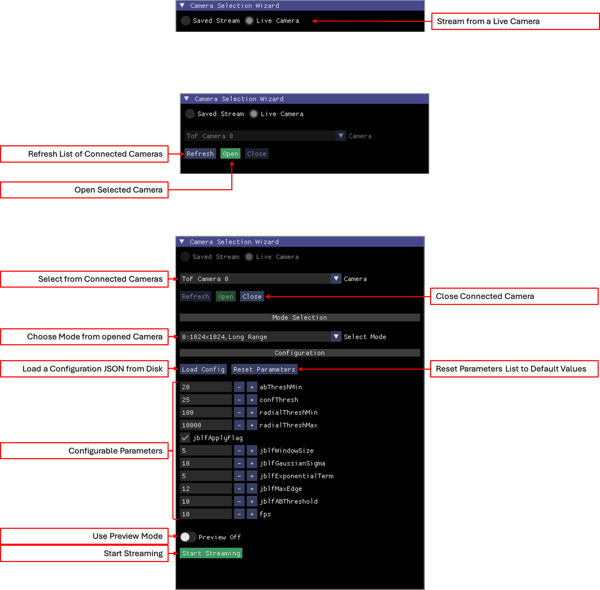](images/aditofgui_wizard_live_stream.png)

This option is used to stream frames from a live ADCAM Time of Flight camera.

1. Select *Live Camera*. Please note, this is only possible if the *Saved Stream* or *Live Camera* is closed.
2. Select *Open*.
3. Select the mode from the dropdown list, where each mode is unique option of size, range and binning. If no mode is chosen, the mode shown is used.
4. (Optional) Configure the device, where the parameters can be loaded from a JSON configuration file via *Load Config* or modified via the *Configurable Parameters* controls.
5. *Start Streaming*, where *Preview* mode allows a reduced frame rate - this is good for streaming  and saving, a recording, at a desired frame without displaying every frame.

##### Saved Stream
[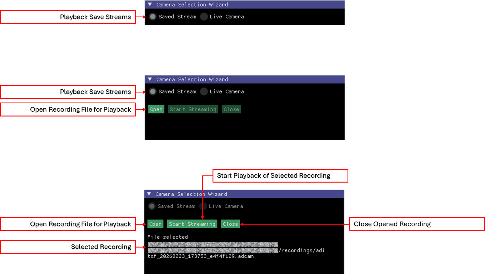](images/aditofgui_wizard_saved_stream.png)

This option is used to stream save recordings.

1. Select *Saved Stream*. Please note, this is only possible if the *Saved Stream* or *Live Camera* is closed.
2. Select *Open*, with the file chooser, select the appropriate **.adcam** file.
3. Select *Start Stream*.

#### Data View

The *Live Camera* and *Saved Stream* views each contains several windows. The windows are the same between the views, where the *Control Window* controls differ slightly between the two views. In the two sub-sections below we will cover the differences. 

Expand the images below to see the data views of the *Live Camera* and *Saved Stream*.

| Live Camera | Saved Stream |
|-------------|--------------|
|[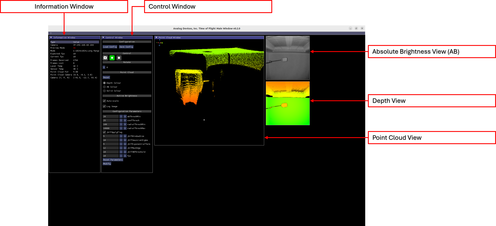](images/aditofgui_live_stream.png)|[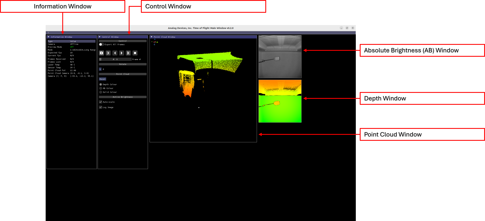](images/aditofgui_saved_stream.png)|

| Window | Definition |
|--------|---------|
|Information Window|This window shows metrics, telemetry and parameters.|
|Control Windows|This window allows the user to configure and control the stream. This is the only window that differs between the two views.|
|Absolute Brightness Window|This window show AB frames. In real time in the Live view and non-realtime in the Saved view.|
|Depth Window|This window shows Depth frames. In real time in the Live view and non-realtime in the Saved view.|
|Point Cloud Window|This window shows point cloud frames. In real time in the Live view and non-realtime in the Saved view.|

##### Information Window

|Type|Definition|
|----|---------|
|Camera|This defines is your are using an online (aka Live Camera) or offline (aka Saved Stream) camera.|
|Preview Mode|Shows if *Preview Mode* is on or off|
|Mode|The current mode as selected by the user for the *Live Camera* view or as saved in the recording for the *Saved Stream* view.|
|Expected fps|The set and expected frame rate.|
|Current fps|The actual frame rate as calculated in real-time.|
|Frames Recevied|Frames received in a session, so far, in real-time.|
|Frames Lost|Frames lost in a session, so far, in real-time.|
|Laser Temp|The current laser temperature as sent via metadata from the imager module.|
|Sensor Temp|The current laser temperature as sent via metadata from the imager module.|
|Point Cloud FoV|The field of view in the point cloud window.|
|Point Cloud Camera|The location of the camera in the point cloud window.|
|Camera (Y, P, R)|The Yaw, Pitch and Rotation of the scene in the point cloud window.|

##### Control Window: Live Camera View

|Type|Definition|
|----|----------|
|Configuration: Load Config|Allows the user to load a configuration JSON file. Device and software parameters are loaded and applied,|
|Configuration: Save Config|Allows the user to save a configuration JSON file. Device and software parameters are stored.|
|Control: Camera Icon|Save a snapshot of the current frame set. This is covered in more detail later.|
|Control: Record Icon|Start recording the stream. Green: the user can start recording. Yellow: the recording is in active. This is covered in more detail later.|
|Control: Stop Icon|Stop the active stream, returning to the *Selection Wizard*.|

##### Control Window: Saved Stream View
TODO

##### ADIToFGUI and Configuration Parameters

This section covers modification of ToF parameters per mode. To accomplish this the user needs to:

1. Save the configuration file, via *Tools->Save Configuration*.

[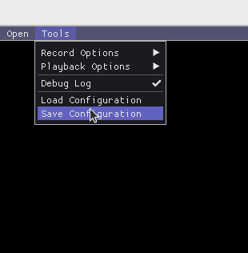](images/aditofgui_6.png)

2. Modify the saved configuration file outside of ADIToFGUI using a text editor.
   
[](images/data_collect_example_3_fps_change.png)

3. Load the configuration file, via *Tools->Load Configuration*.

[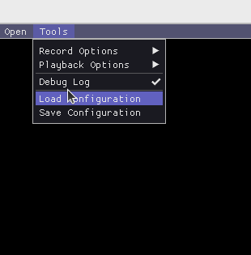](images/aditofgui_7.png)

4. Observing the result.

From the screen capture below you can see the frame rate for mode 1 is now 5fps.

[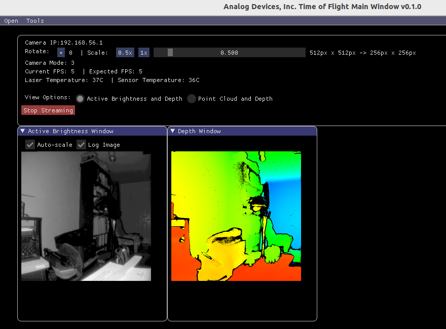](images/aditofgui_8.png)

# Appendix

## Configuration JSON File

For the following discussion [example-cfg.json](other/example-cfg.json) will be referenced.

### General Parameters

These should not be changed in the context of the eval kit unless explicitly asked to do so by ADI.

* *errata1*: DO NOT CHANGE
* *fsyncMode*: DO NOT A
* *mipiOutputSpeed*: DO NOT CHANGE
* *isdeskewEnabled*: DO NOT CHANGE
* *enableTempCompensation*: DO NOT CHANGE
* *enableEdgeConfidence*: DO NOT CHANGE
```
	"errata1":	1,
	"fsyncMode":	-1,
	"mipiOutputSpeed":	1,
  "isdeskewEnabled": 1,
	"enableTempCompensation":	-1,
	"enableEdgeConfidence":	-1,
```

### Mode Parameters

Each supported mode has an entry in the saved file. For example Mode 0 is shown below.

This is further sub-divived into two groups:

* *depth-compute*: These parameters are used to configure the depth compute parameters for the ADSD3500 and depth compute library. A document is avaialble to descript these parameters, please contact ADI at tof@analog.com. Please note, this document is only available under NDA.
* *configuration-parameters*:
    * *fps*: desired frame rate in frames per second.
    * *headerSize*: DO NOT CHANGE.
    * *multiCoreEnable*: Enable use of multiple CPU cores by the depth compute library on the eval kit.
    * *numCores*: The number of CPU cores to use when *multiCoreEnable* is set to *1*.
    * *xyzEnable*: DO NOT CHANGE.
```
	"0":	{
		"depth-compute":	{
			"abThreshMin":	3,
			"bitsInAB":	16,
			"bitsInConf":	0,
			"bitsInPhaseOrDepth":	12,
			"confThresh":	25,
			"depthComputeIspEnable":	1,
			"inputFormat":	"mipiRaw12_8",
			"interleavingEnable":	0,
			"jblfABThreshold":	10,
			"jblfApplyFlag":	1,
			"jblfExponentialTerm":	5,
			"jblfGaussianSigma":	10,
			"jblfMaxEdge":	12,
			"jblfWindowSize":	7,
			"partialDepthEnable":	1,
			"phaseInvalid":	0,
			"radialThreshMax":	4200,
			"radialThreshMin":	30
		},
		"configuration-parameters":	{
			"fps":	10,
			"headerSize":	128,
			"multiCoreEnable":	1,
			"numCores":	4,
			"xyzEnable":	1
		}
	},
```
**