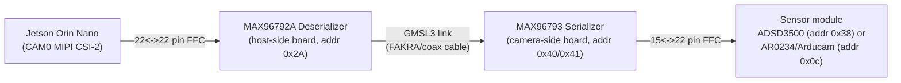

# MAX96793 / MAX96792A GMSL2/3 Tunnel-Mode Init — `config_1_max96793_max96792a_init.py`

Python translation of [config_1.cpp](config_1.cpp) (a Maxim/ADI **CSIConfigurationTool**
export) that brings up a GMSL2/3 link between a **MAX96793** serializer and a
**MAX96792A** deserializer for single-VC RAW8 tunnel-mode MIPI CSI-2 passthrough
(Serializer Port B → Deserializer Pipe Y → Port A, 2-lane D-PHY @ 1000 Mbps/lane —
matches the AR0234's actual 912 Mbps/lane requirement, see "MIPI output frequency
macros" below), plus a MAX7320-driven MFP0 GPIO tunnel for camera sensor reset
control (see "Camera sensor reset / MFP0 GPIO tunnel" below).

## Table of contents

1. [Physical hardware setup](#1-physical-hardware-setup)
   1. [Required items](#11-required-items)
2. [Prerequisites](#2-prerequisites)
3. [Running sequence](#3-running-sequence)
4. [CLI usage reference](#4-cli-usage-reference)
5. [Script structure](#5-script-structure)
6. [What the script does, in order](#6-what-the-script-does-in-order)
7. [Device addressing](#7-device-addressing)
8. [Chip ID / revision readback](#8-chip-id--revision-readback-added-beyond-config_1cpp)
9. [Configuration functions](#9-configuration-functions-gmsl_conf_max96793_max96792a)
10. [Camera sensor reset / MFP0 GPIO tunnel (MAX7320)](#10-camera-sensor-reset--mfp0-gpio-tunnel-max7320)
11. [Lane-configuration debug tracing](#11-lane-configuration-debug-tracing)
12. [MIPI output frequency macros](#12-mipi-output-frequency-macros)
13. [I2C pass-through channel (serializer REG1)](#13-i2c-pass-through-channel-serializer-reg1)
14. [MIPI D-PHY configuration summary](#14-mipi-d-phy-configuration-summary)
15. [Delay markers](#15-delay-markers)
16. [Masked-write rows (`0x55` address)](#16-masked-write-rows-0x55-address)
17. [Deserializer (MAX96792A) register reference](#17-deserializer-max96792a-register-reference)
18. [Serializer (MAX96793) register reference](#18-serializer-max96793-register-reference)
19. [Known issues / limitations](#19-known-issues--limitations)

## 1. Physical hardware setup

### 1.1. Required items

1. Jetson Orin Nano Developer Kit
2. [AD-GMSL793MIPI-EVK Evaluation Board](https://www.analog.com/en/resources/evaluation-hardware-and-software/evaluation-boards-kits/ad-gmsl793mipi-evk.html#eb-overview) (serializer, camera-side board)
3. [AD-GMSL792MIPI-EVK Evaluation Board](https://www.analog.com/en/resources/evaluation-hardware-and-software/evaluation-boards-kits/ad-gmsl792mipi-evk.html#eb-overview) (deserializer, host-side board)
4. AR0234 / ADCAM (Arducam) sensor module
5. 22-pin to 22-pin FFC cable, **opposite-side contacts** (contacts facing outward on both ends, not same-side) — Orin Nano CAM0 to deserializer
6. [15-pin to 22-pin FFC cable](https://www.amazon.in/xcluma-Camera-Cable-Ribbon-Raspberry/dp/B0987XH7H3) — serializer to sensor module (generic/substitute part, not an ADI-qualified cable; verify pinout and contact orientation against the EVK and sensor module before use)
7. FAKRA cable (GMSL3 link between deserializer and serializer)



Both sensor modules sit **behind the same GMSL2/3 link** — only one is
physically attached at a time, and either way, its I2C address is only
reachable once the deserializer/serializer link trains and locks and the
serializer's I2C pass-through channel is enabled. This means this script
must run successfully **before** either sensor's kernel driver can probe or
before any `nvarguscamerasrc`/GStreamer pipeline can stream, regardless of
which module is attached.

## 2. Prerequisites

- Jetson Orin Nano running **NVIDIA JetPack SDK 6.2.2** (or a compatible
  L4T/JetPack release) with the `nv_adsd3500` and/or `arducam_jetvariety`
  kernel modules available (built from the sensor vendor's BSP, not stock
  JetPack).
- Python 3 and the `smbus2` package (see "Running sequence" below).
- Read/write access to the target I2C bus device node (`/dev/i2c-<bus>`,
  default bus `2`) — either run as `root`/`sudo` or add the invoking user to
  the `i2c` group.
- `i2c-tools` (`i2cdetect`, `i2cget`, `i2ctransfer`) installed, useful for
  independently confirming device addresses if this script reports a
  detection failure.
- [GMSL SerDes Public GUI Software](https://www.analog.com/en/resources/evaluation-hardware-and-software/embedded-development-software/software-download.html?swpart=SFW0019760J)
  (Maxim/ADI **CSIConfigurationTool**) — used to generate [config_1.cpp](config_1.cpp),
  the register-sequence export this script is translated from.

## 3. Running sequence

1. **Blacklist the sensor kernel modules** so they don't auto-probe at boot
   before the GMSL link is up. Add to `/etc/modprobe.d/blacklist.conf`
   (bare module name, **no `.ko` suffix** — `blacklist <name>.ko` is invalid
   syntax and is silently ignored):
   ```
   blacklist nv_adsd3500
   blacklist arducam_jetvariety
   ```
   If either module is already loaded, remove it first: `sudo rmmod nv_adsd3500 arducam_jetvariety`.
2. **Run this script** — `python3 config_1_max96793_max96792a_init.py`.
   It must complete with `GMSL configuration succeeded` (GMSL3 link trained
   and locked, serializer I2C pass-through channel enabled) before the
   sensor's I2C address is reachable at all.
3. **Manually load the sensor kernel driver** now that the link is up:
   `sudo modprobe nv_adsd3500` or `sudo modprobe arducam_jetvariety`
   (whichever module matches the sensor physically attached to the serializer).
4. Only after both of the above succeed will `/dev/videoN` exist and
   `nvarguscamerasrc`/`v4l2-ctl` be able to open the sensor.

If `arducam_jetvariety.ko` probes `0x0c` (or the ADSD3500 driver probes
`0x38`) **before** this script has run, the I2C transaction has nothing to
ACK on the other side of the GMSL link, so the kernel probe fails silently
(no `bound` message in `dmesg`, no `/dev/videoN` node) — this is not a driver
bug, it's expected until the link is brought up.


Run it with (for the AR0234):
```bash
python3 config_1_max96793_max96792a_init.py --mipi-freq 1000
```
Requires `smbus2` (`pip install smbus2` / `python3 -m pip install --user smbus2`).

Exit status: `0` on success, `1` if serializer detection or any I2C transaction
fails (`GmslConfigError`) or the I2C bus itself errors out (`OSError`) — see
`main()`.

After it prints `GMSL configuration succeeded`, probe the sensor driver that
matches the module physically attached to the serializer — load only one:

ADSD3500 module:
```bash
sudo modprobe nv_adsd3500
```
AR0234/Arducam module:
```bash
sudo modprobe arducam_jetvariety
```

**Stream the camera** using the script matching the desired AR0234 sensor
mode (each wraps an `nvarguscamerasrc` pipeline for that resolution), passing
`1` as the argument:

- sensor mode 0, 1920×1200
```bash
./get_frames_ar0234_nv_argus_1920_1200_mode0.sh 1
```
- sensor mode 1, 1920×1080
```bash
./get_frames_ar0234_nv_argus_1920_1080_mode1.sh 1
```
- sensor mode 2, 1280×720
```bash
./get_frames_ar0234_nv_argus_1280_720_mode2.sh 1
```

## 4. CLI usage reference

All flags below (except `bus`/`--log-level`, which apply to every run) put
the script into a **standalone, single-purpose mode that skips the full GMSL
bring-up** — only one flag is honored per run, in the priority order listed.
Flags marked "while streaming" require the sensor to actually be transmitting
frames during the check; coordinate two terminals manually (e.g. start a
streaming script from the "Running sequence" section above, then run the
check in a second terminal).

| Option | Values / Default | Purpose | Example |
|---|---|---|---|
| `bus` (positional) | int, default `2` | I2C bus number for every mode | `python3 config_1_max96793_max96792a_init.py 2` |
| `--log-level` | `ALL`\|`DEBUG`\|`INFO`\|`WARNING`\|`ERROR`, default `ALL` | Logging verbosity for every mode (`ALL` shows everything) | `python3 config_1_max96793_max96792a_init.py --log-level INFO` |
| `--mipi-freq` | `800`\|`1000`\|`1500`\|`2000`\|`2500`, default: script constant (`DESERIALIZER_MIPI_OUTPUT_FREQ`, currently 1000) | Override the deserializer's CSI-2 output speed (Mbps/lane) for this run only, without editing the script — runs the **full bring-up** at that speed | `python3 config_1_max96793_max96792a_init.py --mipi-freq 800` |
| `--set-camera-reset` | `0`\|`1` | Skip bring-up; drive the MAX7320 O0 output (MFP0, camera sensor reset) directly. Requires the MFP0 tunnel to already be configured (i.e. a prior full bring-up run) | `python3 config_1_max96793_max96792a_init.py --set-camera-reset 1` |
| `--check-mfp0-tunnel` | flag | Skip bring-up; read-only check that deserializer/serializer MFP0 `GPIO_IN` levels match (does NOT toggle the reset line — the kernel's `maxim,max7320` GPIO driver owns that) | `python3 config_1_max96793_max96792a_init.py --check-mfp0-tunnel` |
| `--check-serializer-mipi-rx` | flag | Skip bring-up; sample the serializer's MIPI RX packet/clock counters twice to confirm the sensor is sending data into the serializer (**while streaming**) | `python3 config_1_max96793_max96792a_init.py --check-serializer-mipi-rx` |
| `--check-deserializer-csi-tx` | flag | Skip bring-up; sample the deserializer's CSI-2 output packet counters twice to confirm Port A is transmitting toward the Jetson (**while streaming**) | `python3 config_1_max96793_max96792a_init.py --check-deserializer-csi-tx` |
| `--check-deserializer-link-rx` | flag | Skip bring-up; confirm the deserializer is receiving ANY packets over the GMSL tunnel at all, independent of CSI-2 output (**while streaming**) | `python3 config_1_max96793_max96792a_init.py --check-deserializer-link-rx` |
| `--check-deserializer-errors` | flag | Skip bring-up; read the deserializer's tunnel-mode error status flags (CRC/ECC errors, video pipe overflow) | `python3 config_1_max96793_max96792a_init.py --check-deserializer-errors` |
| `--check-deserializer-pipe-enables` | flag | Skip bring-up; read the deserializer's LIVE video pipe enable bits (`REG2 VID_EN_Y/Z`, `VIDEO_PIPE_EN`) instead of trusting documented reset defaults | `python3 config_1_max96793_max96792a_init.py --check-deserializer-pipe-enables` |

Typical bring-up-and-diagnose session (bring up the link, defaults to
1000 Mbps/lane; probe the sensor driver; then, if capture still fails, work
through the diagnostic chain in order — run the last command while streaming,
e.g. in a second terminal):
```bash
python3 config_1_max96793_max96792a_init.py
sudo modprobe arducam_jetvariety
python3 config_1_max96793_max96792a_init.py --check-deserializer-pipe-enables
python3 config_1_max96793_max96792a_init.py --check-deserializer-errors
python3 config_1_max96793_max96792a_init.py --check-serializer-mipi-rx
```

## 5. Script structure

- **`GmslConfigError(RuntimeError)`** — raised by the low-level I2C helpers on
  any `OSError`, and by `_detect_serializer_addr()` if neither candidate
  address ACKs. `main()` catches it (and plain `OSError`) and returns exit
  code `1` with a clean log message instead of a raw traceback.
- **`_i2c_write(bus, addr, payload, description="")`** / **`_i2c_read_byte(bus, addr, reg_addr)`**
  — shared low-level helpers used by every register access in the script.
  `_i2c_read_byte` always uses a single repeated-START transaction (write the
  register address, then read — no STOP in between) since a STOP would reset
  the device's internal register pointer.
- **`main(argv=None)`** — `argparse`-based CLI: positional `bus` (default `2`)
  and `--log-level` (default `ALL`), calls `gmsl_conf_max96793_max96792a()`,
  and translates exceptions into an exit code. `--mipi-freq` overrides the CSI
  output speed for a full bring-up run. Several `--check-*` flags bypass full
  GMSL bring-up for standalone, read-mostly diagnostic use instead — see the
  "CLI usage reference" table above for the complete list with examples.
- Every major function logs its own name prefixed with `>>>` as its first
  line (e.g. `>>> _configure_deserializer_link()`), so the console output
  doubles as a call trace on top of the register-level trace.

## 6. What the script does, in order

1. **Log the deserializer's address** (`DESERIALIZER_ADDR = 0x2A`, fixed — no
   probing needed) and **read its REG13/REG14** chip ID/revision.
2. **Detect the serializer.** Probes `SERIALIZER_ADDR_CANDIDATES = [0x40, 0x41]`
   (7-bit addresses derived from the MAX96793's 8-bit default write addresses
   `0x80`/`0x81`) with a dummy `write_byte_data`, and uses whichever one ACKs,
   then **reads its REG13/REG14**.
3. **Replay the `config_1.cpp` register sequence and set up the MFP0 GPIO
   tunnel** via five purpose-specific functions called from
   `gmsl_conf_max96793_max96792a()` — see "Configuration functions" below.
4. **Read back link status** and **I2C pass-through state** — see
   "I2C pass-through channel" below.

## 7. Device addressing

| Constant | Value | Meaning |
|---|---|---|
| `SERIALIZER_ADDR_CANDIDATES` | `[0x40, 0x41]` | MAX96793 7-bit address; two candidates because the default address is pin-strap selectable (`0x80/0x81` 8-bit → `>>1`). |
| `DESERIALIZER_ADDR` | `0x2A` | MAX96792A 7-bit address (`0x54` 8-bit → `>>1`), per `config_1.cpp`'s "Device Address: 0x54" comment. |
| `DESERIALIZER_MASKED_ADDR` | `0x2A` | Same physical 7-bit address as above. `config_1.cpp` addresses REG1/REG4/REG6 as `0x55` (one more than `0x54`) with an extra trailing **mask byte** in the payload — flagged in code as needing hardware review (see "Masked-write rows" below), replayed verbatim as a 4-byte write to the same address rather than assumed to be a distinct device. |

## 8. Chip ID / revision readback (added beyond `config_1.cpp`)

Both the MAX96793 and MAX96792A expose the same register layout for
identification, read via the shared `_i2c_read_byte()` helper's single
repeated-START I2C transaction (write the 2-byte register address, then read
1 byte — **no STOP** in between, or the device's internal register pointer
resets):

| Register | Address | Field | Notes |
|---|---|---|---|
| REG13 | `0x0D` | `DEV_ID[7:0]` | Read-only. `0xB7` = MAX96793, `0xB6` reset (`0xB` family nibble) = MAX96792A. |
| REG14 | `0x0E` | `DEV_REV[3:0]` | Read-only silicon revision ID; meaning is defined only in ADI's separate errata sheet for each part, not the datasheet. |

- `read_serializer_revision(bus, serializer_addr)` reads the MAX96793's REG13/REG14,
  warns if `DEV_ID != 0xB7`.
- `read_deserializer_revision(bus)` reads the MAX96792A's REG13/REG14, warns if
  the `DEV_ID` upper nibble isn't `0xB`, and maps `DEV_REV` to a known silicon
  revision via `DESERIALIZER_SILICON_REVISIONS` (currently `0x6 → "D-0B"`,
  confirmed against ADI's MAX96792A DEV_REV=6 errata sheet).
- Both helpers retry once on an `0xFF` read (a common NACK/floating-bus symptom)
  before logging/returning the value.

**Known anomaly:** on this board, `DEV_ID` (REG13) reads `0xFF` on the
deserializer while `DEV_REV` (REG14) reads a valid, errata-sheet-confirmed
value (`0x6` = D-0B) from the same device — the chip is clearly a real,
responding MAX96792A, but only that one register misbehaves. This was checked
against ADI's D-0B errata sheet and is **not** a documented erratum; treat it
as a hardware/bus item to investigate independently (e.g. `i2ctransfer`/`i2cget`
outside Python), not a script bug — the serializer's equivalent read (`DEV_ID
0xB7`, `DEV_REV 0x6` = C-0D) works perfectly, confirming the read mechanism
itself is correct.

## 9. Configuration functions (`gmsl_conf_max96793_max96792a`)

`gmsl_conf_max96793_max96792a(bus_number)` is a thin orchestrator: it opens the
I2C bus, detects/reads both chips (see above), then calls four
purpose-specific functions **in the exact order the hardware requires**
(deserializer link must come up before either side's MIPI is touched), and
finally reads back status. Each mirrors [config_1.cpp](config_1.cpp) row-by-row
using the same conversion rules as `rpi_adaptr_max96717_max96724_tunnel_porta.cpp`
(a companion reference file, not present in this workspace — see "Known
issues / limitations" below): drop the `0x04` write opcode, shift the 8-bit
device address right by 1 bit, and pass the remaining bytes as the
`i2c_msg.write()` payload.

1. **`_configure_deserializer_link(bus)`** — deserializer only:
   - Disable CSI output (`BACKTOP12.CSI_OUT_EN = 0`) before reconfiguring anything.
   - Disable `AUTO_LINK`, set `RX_RATE`/`GMSL3_A`/`I2CSEL` (the masked-write
     REG1/REG4/REG6 rows), enable `LINK_EN_A`, then set `LINK_CFG`/`RESET_ONESHOT`
     to force a link reset — followed by a **120 msec delay** for the link to relock.
   - Re-enable/adjust `DIS_REM_CC` on REG1/REG3, followed by the tool's
     `~5 usec` (rounded up to ~1 msec) delay.
2. **`configure_mfp0_gpio_tunnel(bus, serializer_addr)`** — both chips: routes
   the camera sensor's reset pin over GMSL before MIPI input starts (see
   "Camera sensor reset / MFP0 GPIO tunnel" below for the full mechanism).
3. **`_configure_serializer_mipi_input(bus, serializer_addr)`** — serializer only:
   - Disable video transmission (`VID_TX_EN_Z = 0`) before changing MIPI settings.
   - MIPI D-PHY config: 1x4 port mode, tunnel mode enabled, Port B 2-lane
     count, PHY1/PHY2 lane maps and polarity — logs a `DEBUG`-level decoded
     lane map (see "Lane-configuration debug tracing" below).
   - Controller→pipe mapping: start Port B video (`FRONTTOP_0`, `FRONTTOP_9`),
     select pipe Z (`CFGV__VIDEO_Z`).
4. **`_configure_deserializer_mipi_output(bus)`** — deserializer only:
   - Video pipe routing: map Pipe Y to Link A stream 0.
   - MIPI D-PHY config: 1x4 port mode, Port A 2-lane count, PHY0/PHY1 lane
     maps and polarity — logs a `DEBUG`-level decoded lane map.
   - Coarse CSI output frequency set (soft-reset DPLL → write frequency
     divider via `DESERIALIZER_MIPI_FREQ_*` macros → release soft-reset, see
     "MIPI output frequency macros" below) and standby unused PHY2/PHY3.
   - Tunnel mode: route Pipe Y to tunnel destination pipe 1 and enable tunnel
     mode, then **re-enable CSI output**.
5. **`_enable_serializer_video_output(bus, serializer_addr)`** — serializer
   only: re-enable video transmission (`VID_TX_EN_Z = 1`) — video is now
   flowing end-to-end.

Every write is followed by a `logging.info(...)` call carrying the original
`.cpp` comment, so the script's console output doubles as a register-level
trace of the bring-up sequence.

## 10. Camera sensor reset / MFP0 GPIO tunnel (MAX7320)

Added beyond `config_1.cpp`: routes the camera sensor's reset GPIO over the
GMSL link so it can be driven from the host, since the sensor's reset pin is
not directly wired to the Jetson — it's driven by a **MAX7320** I2C GPO port
expander on the host side, tunneled across GMSL to the camera module:

```
Orin Nano (I2C) -> MAX7320 O0 -> MAX96792A MFP0 -> MAX96793 MFP0 -> camera sensor reset GPIO
```

- **`MAX7320_ADDR = 0x58`** — address-only I2C GPO device (no internal register
  pointer; reads/writes go directly to the 8-bit output latch). `MAX7320_MFP0_BIT`
  (`0x01`) is O0, hardwired to MFP0.
- **`configure_mfp0_gpio_tunnel(bus, serializer_addr, channel_id=0)`** — one-time
  setup, called from `gmsl_conf_max96793_max96792a()`: tri-states the
  deserializer's own MFP0 driver (`GPIO_OUT_DIS=1`) so it doesn't fight the
  MAX7320's external drive, and forwards the externally-driven pin level over
  GMSL (`GPIO_TX_EN=1`); the serializer's MFP0 receives that value
  (`GPIO_RX_EN=1`) and drives it out on its own pin (`GPIO_OUT_DIS=0`), wired to
  the sensor's reset GPIO.
- **`set_camera_sensor_reset(bus, enable)`** — a read-modify-write on the
  MAX7320's output latch. Requires `configure_mfp0_gpio_tunnel()` to have run
  first. Exposed standalone via `--set-camera-reset {0,1}`, but **not called
  automatically** anywhere else in this script: on real hardware the kernel's
  `maxim,max7320` GPIO driver (bound to `arducam@0c`'s `reset-gpios` in the
  `.dts`) owns actual reset control once loaded, and userspace writes here
  would race with it. Only use this flag for manual bring-up/debugging before
  that driver is bound.
- **`read_mfp0_tunnel_status(bus, serializer_addr)`** / **`check_mfp0_tunnel(bus, serializer_addr)`**
  — read-only verification helpers, since GMSL GPIO tunneling has no "link
  established" status bit; it just continuously forwards the sampled pin
  level. They compare the read-only `GPIO_IN` bit (bit 3, `0x08`) on both ends
  — if the tunnel is forwarding correctly, deserializer and serializer
  `GPIO_IN` always match. `check_mfp0_tunnel()` only reads the current level
  on both ends (it does **not** call `set_camera_sensor_reset()`, to avoid
  fighting the kernel driver's control of the reset line). Exposed standalone
  via `--check-mfp0-tunnel`.

| Register | Address | Field | Notes |
|---|---|---|---|
| Deserializer GPIO_A (GPIO 0) | `0x02B0` | bits: `GPIO_OUT`(4) `GPIO_IN`(3, RO) `GPIO_RX_EN`(2) `GPIO_TX_EN`(1) `GPIO_OUT_DIS`(0) | Tunnel setup: `GPIO_TX_EN=1 GPIO_RX_EN=0 GPIO_OUT_DIS=1` |
| Deserializer GPIO_B (GPIO 0) | `0x02B1` | bits `[4:0]`: `GPIO_TX_ID` | Set to `channel_id` (default `0`) |
| Serializer GPIO_A (GPIO 0) | `0x02BE` | same bit layout as deserializer GPIO_A | Tunnel setup: `GPIO_RX_EN=1 GPIO_TX_EN=0 GPIO_OUT_DIS=0` |
| Serializer GPIO_C (GPIO 0) | `0x02C0` | bits `[4:0]`: `GPIO_RX_ID` | Set to `channel_id` (default `0`) |
| MAX7320 output latch | `0x58` (no register addr) | bit 0 = O0/MFP0 | Read-modify-write via `set_camera_sensor_reset()` |

## 11. Lane-configuration debug tracing

Both `_configure_serializer_mipi_input()` and `_configure_deserializer_mipi_output()`
decode their own lane-count/lane-map register constants and emit a
`logging.debug(...)` summary (visible at `--log-level DEBUG` or the default
`ALL`), filtered to only show mappings whose destination lane index is within
the active lane count — so a 2-lane configuration doesn't print misleading
Lane2/Lane3 entries that are configured in the register but not actually
enabled:

```
DEBUG - Serializer MIPI input lane config: 2 active lane(s), Sensor->Serializer map: Lane0<-Sensor0 Lane1<-Sensor1
DEBUG - Deserializer MIPI output lane config: 2 active lane(s), PHY->Port A map: PHY1.D0->Lane0 PHY1.D1->Lane1
```

## 12. MIPI output frequency macros

`DESERIALIZER_MIPI_FREQ_REG` (`BACKTOP25`, `0x0320`) plus
`DESERIALIZER_MIPI_FREQ_PREDEF_EN_BIT` (bit 5, enables the predefined-frequency
field) and named speed codes, decoded from `max96792a.pdf`'s
`phy1_csi_tx_dpll_predef_freq[4:0]` table:

| Macro | Value | Speed |
|---|---|---|
| `DESERIALIZER_MIPI_FREQ_800MBPS` | `0x08` | 800 Mbps/lane (original `config_1.cpp` value) |
| `DESERIALIZER_MIPI_FREQ_1000MBPS` | `0x0A` | 1000 Mbps/lane (used by the script — nearest predefined rate ≥ the AR0234's actual 912 Mbps/lane requirement) |
| `DESERIALIZER_MIPI_FREQ_1500MBPS` | `0x0F` | 1500 Mbps/lane |
| `DESERIALIZER_MIPI_FREQ_2000MBPS` | `0x14` | 2000 Mbps/lane |
| `DESERIALIZER_MIPI_FREQ_2500MBPS` | `0x19` | 2500 Mbps/lane |

The actual register write is
`DESERIALIZER_MIPI_FREQ_PREDEF_EN_BIT | DESERIALIZER_MIPI_FREQ_1000MBPS` = `0x2A`
(originally `0x28`/800 Mbps to match `config_1.cpp` byte-for-byte, since
changed for the AR0234 — see "MIPI D-PHY configuration summary" below); swap
in a different `_MBPS` macro to change the CSI output speed.

## 13. I2C pass-through channel (serializer REG1)

Added beyond `config_1.cpp`: helpers to bridge a downstream I2C device (e.g. a
port expander) wired to the serializer's local I2C pins onto the GMSL control
channel, so it becomes reachable from the host.

- `SERIALIZER_REG1` (`0x0001`) holds `IIC_1_EN` (bit 6, Channel 1: `SDA1/RX1`,
  `SCL1/TX1`) and `IIC_2_EN` (bit 7, Channel 2: `SDA2/RX2`, `SCL2/TX2`) — both
  disabled by default in `config_1.cpp`.
- `read_serializer_i2c_passthrough(bus, serializer_addr)` reads REG1 and logs
  both bits' state.
- `_set_serializer_passthrough_bit(...)` performs a **read-modify-write** on
  REG1 (it also holds `DIS_LOCAL_CC`/`DIS_REM_CC`/`TX_RATE`/`RX_RATE`, so a
  blind overwrite would clobber them).
- `enable_serializer_i2c_passthrough_channel1(bus, serializer_addr, enable=True)`
  / `enable_serializer_i2c_passthrough_channel2(...)` set/clear the
  corresponding bit and log the resulting REG1 value.
- `gmsl_conf_max96793_max96792a()` calls `enable_serializer_i2c_passthrough_channel1()`
  then `read_serializer_i2c_passthrough()` at the end of the run, purely to
  confirm the channel got enabled — it's not required for the base
  video-only bring-up.

## 14. MIPI D-PHY configuration summary

Pulled together from the individual register writes in
`gmsl_conf_max96793_max96792a()` — two independent D-PHY links: CSI-2 **input**
into the serializer (from the camera module) and CSI-2 **output** from the
deserializer (to the Jetson host).

### Serializer (MAX96793) — CSI-2 input, Port B

| Parameter | Value | Source write |
|---|---|---|
| Port configuration | 1x4 | `MIPI_RX0` (`0x0330`) = `0x00` |
| Active port | Port B | `MIPI_RX1` (`0x0331`) = `0x10` |
| Lane count | 2 | `MIPI_RX1` (`0x0331`) = `0x10` (`ctrl1_num_lanes`) |
| Lane map | PHY1: D0→Lane 2, D1→Lane 3 | `MIPI_RX2` (`0x0332`) = `0xE0` |
| Lane map | PHY2: D0→Lane 0, D1→Lane 1 | `MIPI_RX3` (`0x0333`) = `0x04` |
| Polarity | PHY1 D0/D1: Normal | `MIPI_RX4` (`0x0334`) = `0x00` |
| Polarity | PHY2 D0/D1 + clock: Normal | `MIPI_RX5` (`0x0335`) = `0x00` |
| Tunnel mode | Enabled | `MIPI_RX_EXT:EXT11` (`0x0383`) = `0x80` |
| Speed | Not set here — GMSL3 forward link is a fixed 12Gbps PAM4 rate set by a hardware resistor strap (no MIPI RX speed register in `config_1.cpp`) | — |

### Deserializer (MAX96792A) — CSI-2 output, Port A

| Parameter | Value | Source write |
|---|---|---|
| Port configuration | 2 (1x4) | `MIPI_PHY0` (`0x0330`) = `0x04` |
| Active port | Port A | `MIPI_TX10` (`0x044A`) = `0x50` |
| Lane count | 2 | `MIPI_TX10` (`0x044A`) = `0x50` (`CSI2_LANE_CNT`) |
| Lane map | PHY0: D0→Lane 2, D1→Lane 3 | `MIPI_PHY3` (`0x0333`) = `0x4E` |
| Lane map | PHY1: D0→Lane 0, D1→Lane 1 | `MIPI_PHY3` (`0x0333`) = `0x4E` |
| Polarity | PHY0/PHY1 lanes + clock: Normal | `MIPI_PHY5` (`0x0335`) = `0x00` |
| Unused PHYs | PHY2/PHY3 put in standby (only PHY0/PHY1 drive Port A) | `MIPI_PHY2` (`0x0332`) = `0x34` |
| Speed | 1000 Mbps/lane (coarse frequency divider, set while the DPLL is held in soft-reset) | `DPLL_0` (`0x1D00`) = `0xF4` → `0x0320` = `0x2A` → `DPLL_0` = `0xF5` |
| Tunnel routing | Pipe Y → tunnel destination pipe 1, tunnel mode enabled | `MIPI_TX52` (`0x0474`) = `0x09` |

The two D-PHY links are independent: the serializer's Port B (2 lanes) simply
tunnels raw GMSL3 payload through to the deserializer, which re-emits it on
its own Port A (2 lanes, 1000 Mbps/lane) toward the host — lane counts happen
to match on both sides in this configuration but are set by separate
registers on each chip.

## 15. Delay markers

`config_1.cpp` encodes delays as `0x00,<value>,` rows where `<value>` is the
delay in milliseconds (e.g. `0x78` = 120 → "120 msec delay"). The script
converts these directly to `time.sleep(value / 1000.0)`.

## 16. Masked-write rows (`0x55` address)

Three rows in `config_1.cpp` (REG1/REG4/REG6) target device address `0x55`
instead of `0x54` and carry an extra trailing byte (e.g.
`0x04,0x55,0x00,0x01,0x03,0x03`). `0x55 >> 1` resolves to the same 7-bit
address as `0x54` (`0x2A`), so the script currently replays these as a single
4-byte block write (`[reg_hi, reg_lo, value, mask]`) to `DESERIALIZER_ADDR`.
This byte-for-byte replay matches the source table exactly, but the real
hardware semantics of the trailing mask byte (a genuine masked
read-modify-write vs. an artifact of the export tool) haven't been confirmed
against the MAX96792A datasheet/errata — worth reviewing if these three
registers don't take effect as expected on real hardware.

## 17. Deserializer (MAX96792A) register reference

Every register the script touches on the deserializer, in execution order.
Addresses are the full 16-bit `[reg_hi, reg_lo]` value used in the
`i2c_msg.write()` payload; "masked write" rows go to `DESERIALIZER_MASKED_ADDR`
(`0x55`) with a trailing mask byte instead of `DESERIALIZER_ADDR` (`0x54`).

| Register | Address | Value | Meaning |
|---|---|---|---|
| REG13 (read) | `0x000D` | — (read-only) | `DEV_ID`; expected `0xB6` (`0xB` family nibble) — currently reads `0xFF` on this board, see "Known anomaly" above |
| REG14 (read) | `0x000E` | — (read-only) | `DEV_REV`; `0x6` confirmed = silicon revision D-0B |
| BACKTOP12 | `0x0313` | `0x00` | `CSI_OUT_EN`: CSI output disabled |
| TCTRL:CTRL0 | `0x0010` | `0x01` | `AUTO_LINK`: Disabled |
| DEV:REG1 (masked) | `0x0001` | `0x03`, mask `0x03` | `RX_RATE` = `0b11` (12Gbps, GMSL3-only rate) |
| DEV:REG4 (masked) | `0x0004` | `0x40`, mask `0x40` | `GMSL3_A`: Enabled (Link A = GMSL3, not GMSL2) |
| DEV:REG6 (masked) | `0x0006` | `0x10`, mask `0x10` | `I2CSEL`: I2C |
| GMSL1_COMMON:GMSL1_EN | `0x0F00` | `0x01` | `LINK_EN_A`: Enabled, `LINK_EN_B`: Disabled |
| TCTRL:CTRL0 | `0x0010` | `0x21` | `LINK_CFG`=`0x1`, `RESET_ONESHOT` (Link A): Activated — forces link reset/relock |
| *(120 msec delay for link to relock)* | | | |
| DEV:REG1 | `0x0001` | `0x03` | `DIS_REM_CC`: Enabled |
| DEV:REG3 | `0x0003` | `0x57` | `DIS_REM_CC_B`: Disabled |
| *(~5 usec delay, rounded to ~1 msec)* | | | |
| GPIO_A (GPIO 0) | `0x02B0` | computed | `GPIO_TX_EN=1 GPIO_RX_EN=0 GPIO_OUT_DIS=1` (tri-state local driver, forward MAX7320-driven level over GMSL) — from `configure_mfp0_gpio_tunnel()` |
| GPIO_B (GPIO 0) | `0x02B1` | `0x00` | `GPIO_TX_ID`: 0 (tunnel channel) |
| VIDEO_PIPE_SEL | `0x0161` | `0x30` | `VIDEO_PIPE_SEL_Y` (`STR_SELY`): Link A Stream Id 0 |
| MIPI_PHY0 | `0x0330` | `0x04` | `phy_4x2` (Port Configuration): 2 (1x4) |
| MIPI_TX10 | `0x044A` | `0x50` | `CSI2_LANE_CNT` (Port A Lane Count): 2 |
| MIPI_PHY3 | `0x0333` | `0x4E` | Lane map: PHY0 D0/D1, PHY1 D0/D1 |
| MIPI_PHY5 | `0x0335` | `0x00` | Polarity map: PHY0/PHY1 lanes + clock, all Normal |
| DPLL_0 | `0x1D00` | `0xF4` | `config_soft_rst_n` (PHY1): `0x0` — assert DPLL soft reset |
| DPLL_0 | `0x1D00` | `0xF4` | Repeated write (no unique field change in source table) |
| *(coarse frequency divider)* | `0x0320` | `0x2A` | Sets CSI output frequency: 1000 Mbps/lane |
| DPLL_0 | `0x1D00` | `0xF5` | `config_soft_rst_n` (PHY1): `0x1` — release DPLL soft reset |
| MIPI_PHY2 | `0x0332` | `0x34` | `phy_Stdby_n`: put unused PHY2/PHY3 in standby |
| MIPI_TX52 | `0x0474` | `0x09` | `TUN_DEST` (Pipe Y): 1, `TUN_EN`: Enabled |
| BACKTOP12 | `0x0313` | `0x02` | `CSI_OUT_EN`: CSI output enabled |
| REG4 (read) | `0x0004` | — | Link status readback: `GMSL3_A` (bit 6) |
| REG1 (read) | `0x0001` | — | Link status readback: `RX_RATE` (bits `[1:0]`) |
| CTRL3 (read) | `0x0013` | — | Link status readback: `LOCKED` (bit 3), `CMU_LOCKED` (bit 1) |

## 18. Serializer (MAX96793) register reference

Every register the script touches on the serializer, in execution order.
Addresses are the full 16-bit `[reg_hi, reg_lo]` value; all writes go to
whichever address in `SERIALIZER_ADDR_CANDIDATES` ACKed during detection.

| Register | Address | Value | Meaning |
|---|---|---|---|
| REG13 (read) | `0x000D` | — (read-only) | `DEV_ID`; `0xB7` = MAX96793 (confirmed) |
| REG14 (read) | `0x000E` | — (read-only) | `DEV_REV`; `0x6` confirmed = silicon revision C-0D |
| GPIO_A (GPIO 0) | `0x02BE` | computed | `GPIO_RX_EN=1 GPIO_TX_EN=0 GPIO_OUT_DIS=0` (receive tunneled level, drive sensor reset pin) — from `configure_mfp0_gpio_tunnel()` |
| GPIO_C (GPIO 0) | `0x02C0` | `0x00` | `GPIO_RX_ID`: 0 (tunnel channel) |
| DEV:REG2 | `0x0002` | `0x03` | `VID_TX_EN_Z`: Disabled (before changing MIPI settings) |
| MIPI_RX0 | `0x0330` | `0x00` | Port Configuration: 1x4 |
| MIPI_RX_EXT:EXT11 | `0x0383` | `0x80` | `Tun_Mode`: Tunnel Mode Enabled |
| MIPI_RX1 | `0x0331` | `0x10` | `ctrl1_num_lanes` (Port B Lane Count): 2 |
| MIPI_RX2 | `0x0332` | `0xE0` | Lane map: PHY1 D0 → Lane 2, D1 → Lane 3 |
| MIPI_RX3 | `0x0333` | `0x04` | Lane map: PHY2 D0 → Lane 0, D1 → Lane 1 |
| MIPI_RX4 | `0x0334` | `0x00` | Polarity map: PHY1 lanes Normal |
| MIPI_RX5 | `0x0335` | `0x00` | Polarity map: PHY2 lanes + clock Normal |
| FRONTTOP_0 | `0x0308` | `0x64` | `CLK_SELZ`: Port B, `START_PORTB`: Enabled |
| FRONTTOP_9 | `0x0311` | `0x40` | `START_PORTBZ`: Start Video |
| CFGV__VIDEO_Z:TX3 | `0x005B` | `0x00` | `TX_STR_SEL` (Pipe Z): `0x0` |
| DEV:REG2 | `0x0002` | `0x43` | `VID_TX_EN_Z`: Enabled — video now flowing |
| REG1 (read) | `0x0001` | — | I2C pass-through readback: `IIC_1_EN` (bit 6), `IIC_2_EN` (bit 7) |
| REG1 (read-modify-write) | `0x0001` | sets bit 6 | `enable_serializer_i2c_passthrough_channel1()`: bridges local I2C Channel 1 (`SDA1/SCL1`) onto the GMSL control channel, needed to reach downstream I2C devices (e.g. a port expander) wired to the serializer's local bus — not required for the base video-only bring-up, disabled by default in `config_1.cpp` |

## 19. Known issues / limitations

- **Deserializer `DEV_ID` (REG13) reads `0xFF`** while `DEV_REV` (REG14) reads
  a valid, errata-confirmed value (`0x6` = D-0B) — see "Chip ID / revision
  readback" above. Confirmed against ADI's D-0B errata sheet as **not** a
  documented erratum; treat as a hardware/bus item to investigate
  independently (e.g. `i2ctransfer`/`i2cget`), not a script bug.
- **Masked-write rows (REG1/REG4/REG6 at address `0x55`)** are replayed
  byte-for-byte from `config_1.cpp`, but the true hardware semantics of the
  trailing mask byte haven't been confirmed against the MAX96792A
  datasheet/errata — see "Masked-write rows" above.
- **`set_camera_sensor_reset()` can race the kernel's `maxim,max7320` GPIO
  driver** once it's bound — only use `--set-camera-reset` for manual
  bring-up/debugging before that driver loads.
